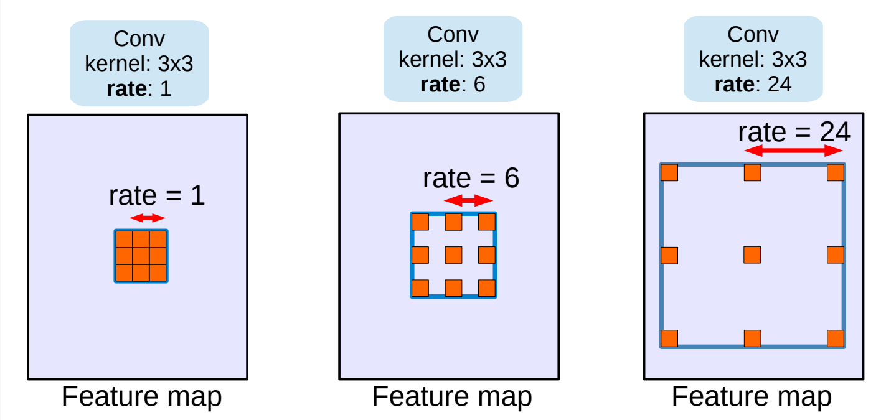

---
title: DeepLab Series
authors: [visualdust]
tags: [segmentation, decoder, atrous-convolution, backbone]
--- 

DeepLab系列中包含了三篇论文：DeepLab-v1、DeepLab-v2、DeepLab-v3。

DeepLab-v1：[Semantic Image Segmentation with Deep Convolutional Nets and Fully Connected CRFs](https://arxiv.org/abs/1412.7062)

DeepLab-v2：[Image Segmentation with Deep Convolutional Nets, Atrous Convolution, and Fully Connected CRFs](https://arxiv.org/abs/1606.00915)

DeepLab-v3：[Rethinking Atrous Convolution for Semantic Image Segmentation](https://arxiv.org/pdf/1706.05587.pdf)

在这里我们将这三篇放在一起阅读。

后来甚至还出现了后续：

DeepLab-v3+：[Encoder-Decoder with Atrous Separable Convolution for Semantic Image Segmentation](https://arxiv.org/abs/1802.02611)

不过暂时没有写进来的打算。

<!--truncate-->

## DeepLab-v1

DeepLab-v1的原论文是[Semantic Image Segmentation with Deep Convolutional Nets and Fully Connected CRFs](https://arxiv.org/abs/1412.7062)。

> In this work we address the task of semantic image segmentation with Deep Learning and make three main contributions that are experimentally shown to have substantial practical merit. First, we highlight convolution with upsampled filters, or 'atrous convolution', as a powerful tool in dense prediction tasks. Atrous convolution allows us to explicitly control the resolution at which feature responses are computed within Deep Convolutional Neural Networks. It also allows us to effectively enlarge the field of view of filters to incorporate larger context without increasing the number of parameters or the amount of computation. Second, we propose atrous spatial pyramid pooling (ASPP) to robustly segment objects at multiple scales. ASPP probes an incoming convolutional feature layer with filters at multiple sampling rates and effective fields-of-views, thus capturing objects as well as image context at multiple scales. Third, we improve the localization of object boundaries by combining methods from DCNNs and probabilistic graphical models. The commonly deployed combination of max-pooling and downsampling in DCNNs achieves invariance but has a toll on localization accuracy. We overcome this by combining the responses at the final DCNN layer with a fully connected Conditional Random Field (CRF), which is shown both qualitatively and quantitatively to improve localization performance. Our proposed "DeepLab" system sets the new state-of-art at the PASCAL VOC-2012 semantic image segmentation task, reaching 79.7% mIOU in the test set, and advances the results on three other datasets: PASCAL-Context, PASCAL-Person-Part, and Cityscapes. All of our code is made publicly available online.

在之前的语义分割网络中，分割结果往往比较粗糙，原因主要有两个，一是因为池化导致空间信息丢失，二是没有利用临近像素点类别之间的概率关系，针对这两点，作者提出了针对性的改进。首先使用**空洞卷积（Atrous Convolution）**，避免池化带来的信息损失，然后使用**条件随机场（CRF）**，进一步优化分割精度。阅读这篇论文应关注的重点问题就是空洞卷积和条件随机场。

### 空洞卷积

空洞卷积（Dilated/Atrous Convolution或是Convolution with holes ）的主要作用是在增大感受野的同时，不增加参数数量，而且VGG中提出的多个小卷积核代替大卷积核的方法，只能使感受野线性增长，而多个空洞卷积串联，可以实现指数增长。

#### 空洞卷积的优势

- 这种结构代替了池化，它可以保持像素空间信息。
- 它由于可以扩大感受野因而可以很好地整合上下文信息。

Convolution with holes 字如其名，是在标准的卷积核中注入空洞，以此来增加感受野。相比于普通的卷积，空洞卷积多了一个超参数称之为空洞率（dilation rate）指的是kernel的间隔的像素数量。

上图是一张空洞卷积的示意图。在上图中，三个空洞卷积的大小都是$3\times 3$，而它们的空洞率分别是1、6和24，所以能用相同大小的卷积核得到不同的感受野。

#### 空洞卷积的问题

- 网格效应（The Gridding Effect）

  空洞卷积层并不能随意设计，例如，我们简单地堆叠空洞率为2的$3\times 3$的空洞卷积核，那么连续三层卷积核在原图上的同个像素位置所对应的感受野如下图所示：

  

  很明显，标圆圈的位置一直没有参与该位置的卷积运算。也就是并不是所有的像素都用来计算了，这会导致信息的连续性损失。这对密集预测（逐像素）的视觉任务来说是致命的。

- 相关性丢失

  原论文中描述问题的话是：

  > Long-ranged information might be not relevant.

  也就是说，我们从 dilated convolution 的设计背景来看就能推测出这样的设计是用来获取 long-ranged information。然而仅采用大 dilation rate 的信息或许只对一些大物体分割有效果，而对小物体来说可能则有弊无利了。如何同时处理不同大小的物体的关系，则是设计好 dilated convolution 网络的关键。

#### 混合膨胀卷积（Hybrid Dilated Convolution, HDC）

对于刚才提到的空洞卷积的问题，论文中提出了一种称为HDC的结构作为解决方案。这个方案具有以下特性：

- 对于每层空洞卷积，其最大空洞卷积率的最小公因子不能为1。
- 

### 条件随机场

条件随机场，简单来讲就是每个像素点作为节点，像素与像素间的关系作为边，即构成了一个条件随机场。通过二元势函数描述像素点与像素点之间的关系，鼓励相似像素分配相同的标签，而相差较大的像素分配不同标签，而这个“距离”的定义与颜色值和实际相对距离有关。所以这样CRF能够使图片在分割的边界出取得比较好的效果。

## DeepLab-v2

DeepLab-v2的原论文是[Image Segmentation with Deep Convolutional Nets, Atrous Convolution, and Fully Connected CRFs](https://arxiv.org/abs/1606.00915)。

> Deep Convolutional Neural Networks (DCNNs) have recently shown state of the art performance in high level vision tasks, such as image classification and object detection. This work brings together methods from DCNNs and probabilistic graphical models for addressing the task of pixel-level classification (also called "semantic image segmentation"). We show that responses at the final layer of DCNNs are not sufficiently localized for accurate object segmentation. This is due to the very invariance properties that make DCNNs good for high level tasks. We overcome this poor localization property of deep networks by combining the responses at the final DCNN layer with a fully connected Conditional Random Field (CRF). Qualitatively, our "DeepLab" system is able to localize segment boundaries at a level of accuracy which is beyond previous methods. Quantitatively, our method sets the new state-of-art at the PASCAL VOC-2012 semantic image segmentation task, reaching 71.6% IOU accuracy in the test set. We show how these results can be obtained efficiently: Careful network re-purposing and a novel application of the 'hole' algorithm from the wavelet community allow dense computation of neural net responses at 8 frames per second on a modern GPU.

DeepLab-v2对DeepLab-v1的改进是：

- 使用了金字塔多尺度特征获得更好的分割效果。
- 将骨干网络由VGG替换为了ResNet。
- 稍微修改了learning-rate。

其中ASPP的引入是最大也是最重要的改变。多尺度主要是为了解决目标在图像中表现为不同大小时仍能够有很好的分割结果，比如同样的物体，在近处拍摄时物体显得大，远处拍摄时显得小。具体做法是并行的采用多个采样率的空洞卷积提取特征，再将特征融合，类似于空间金字塔结构，形象的称为Atrous Spatial Pyramid Pooling (ASPP)。

## DeepLab-v3

DeepLab-v3的原论文是[Rethinking Atrous Convolution for Semantic Image Segmentation](https://arxiv.org/abs/1706.05587)。

> In this work, we revisit atrous convolution, a powerful tool to explicitly adjust filter's field-of-view as well as control the resolution of feature responses computed by Deep Convolutional Neural Networks, in the application of semantic image segmentation. To handle the problem of segmenting objects at multiple scales, we design modules which employ atrous convolution in cascade or in parallel to capture multi-scale context by adopting multiple atrous rates. Furthermore, we propose to augment our previously proposed Atrous Spatial Pyramid Pooling module, which probes convolutional features at multiple scales, with image-level features encoding global context and further boost performance. We also elaborate on implementation details and share our experience on training our system. The proposed `DeepLabv3' system significantly improves over our previous DeepLab versions without DenseCRF post-processing and attains comparable performance with other state-of-art models on the PASCAL VOC 2012 semantic image segmentation benchmark.

DeepLab-v3的改进是：

- 提出了更通用的框架，适用于任何网络。
- 将ResNet最后的一些模块替换为使用空洞卷积进行的级联。
- 在ASPP中使用了Batch Normolization层。
- 去除了条件随机场。