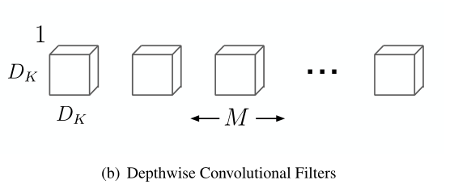
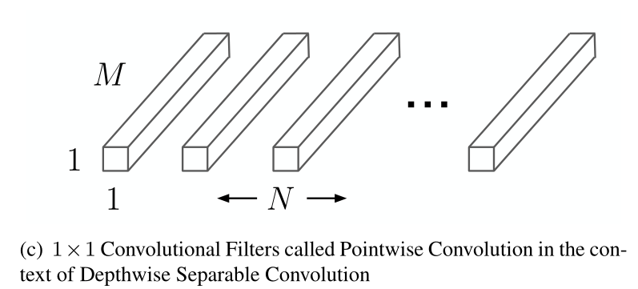
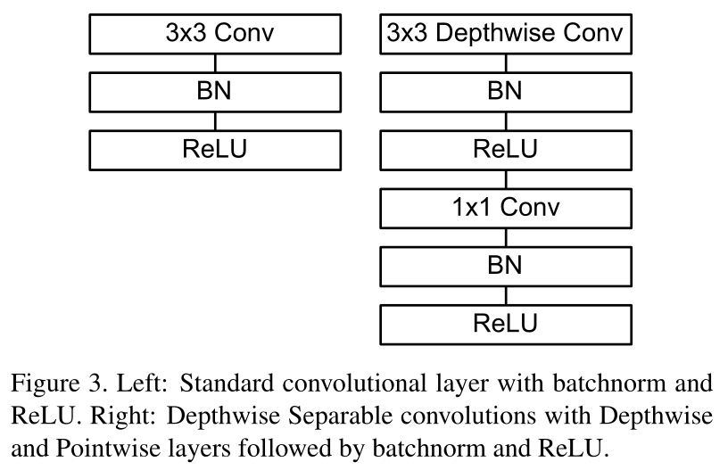
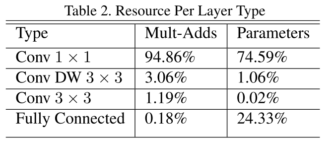
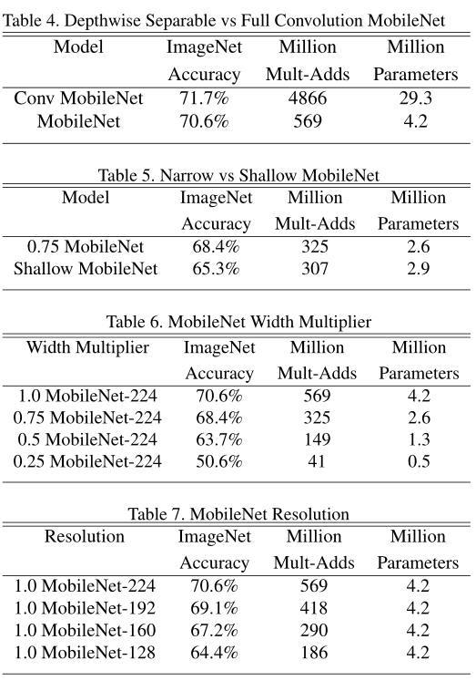
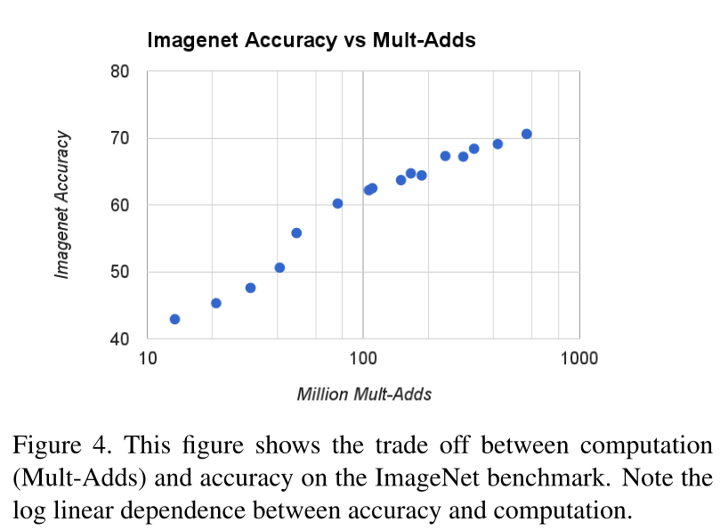
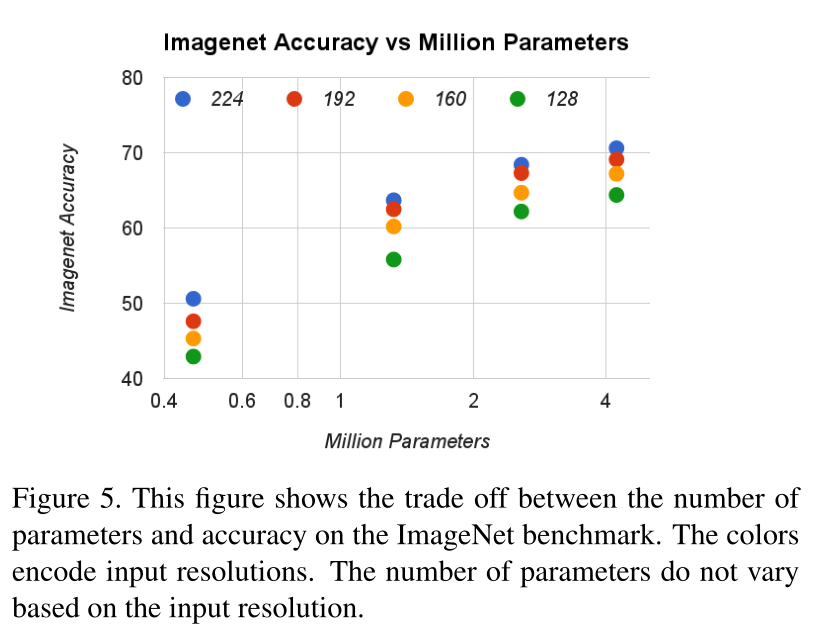
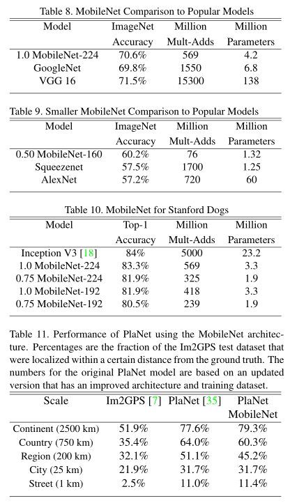

---
title: MobileNets - Efficient Convolutional Neural Networks for Mobile Vision Applications
authors: [pommespeter]
tags: [detection, backbone, light-weight]
--- 

这是一篇讲解一种轻量级主干网络的论文。[原论文（MobileNets: Efficient Convolutional Neural Networks for Mobile Vision Applications）](https://arxiv.org/abs/1704.04861)。

- 本文提出了一种应用于移动或者嵌入式设备的高效神经网络
- 本文提出了一种操作数较小的卷积模块深度可分离卷积(Depthwise Separable Convolution，以下称DSC)

摘要:

> We present a class of efficient models called MobileNets for mobile and embedded vision applications. MobileNets are based on a streamlined architecture that uses depthwise separable convolutions to build light weight deep neural networks. We introduce two simple global hyper-parameters that efficiently trade off between latency and accuracy. These hyper-parameters allow the model builder to choose the right sized model for their application based on the constraints of the problem. We present extensive experiments on resource and accuracy tradeoffs and show strong performance compared to other popular models on ImageNet classification. We then demonstrate the effectiveness of MobileNets across a wide range of applications and use cases including object detection, finegrain classification, face attributes and large scale geo-localization.

<!--truncate-->

# Introduction

卷积神经网络已经普遍应用于计算机视觉领域，但是随着神经网络网络的发展，各种类型的识别精度不断在提高，但与此同时导致速度方面却很慢，提高准确率不一定会让速度或大小更小。所以我们需要通过一种有效的网络结构和两种超参数：通道长度调整系数(width multiplier)和分辨率调整系数(resolution multiplier)

# Realted Work

现在针对轻量网络方面的研究也再不断增加，但很多还是没有注意速度，只是关注模型大小，不考虑速度。而本文算法主要是用了深度可分离卷积(depthwise separable convolution)进行卷积操作.最近DSC用于Inception网络来减少计算量。在Factorized Network中介绍了一种类似的分离式卷积。另一个小型网络是SqueezeNet，它使用瓶颈方法设计一个非常小的网络。目前还有的办法是通过hash，剪枝，蒸馏，矢量量化，哈夫曼编码等方式进行优化。

### MobileNet Architecture

> depthwise卷积：对每个输入通道单独使用一个卷积核处理。
>
> pointwise卷积：$1\times1$卷积，用于将depthwise卷积的输出组合起来。

- Depthwise Separable Convolution

  深度可分离卷积是一个把标准的卷积分解成深度卷积(depthwise convolution)和一个$1\times1$的卷积，被称为点卷积(pointwise convolution).用单个卷积对输入图片每一个通道都进行一次深度卷积DW，然后再对深度卷积的输出结果使用$1\times1$的卷积。

  对于标准的卷积来说，是一步就将两个filter和输入组合成一个新的输出，而DSC则是分成两层，一层是做滤波，另一层是做组合拼接。

  + 计算分析

    > 对于DW
    >
    > - 输入: $D_F\times D_F\times M$，输出:$D_F\times D_F\times M$，卷积核:$D_K\times D_K$
    >
    > - 计算量: $D_K\times D_K\times M\times D_F\times D_F$
    > - 理解: 将输入的特征图($$D_F\times D_F\times M$$)看做是M个$D_F\times D_F\times1$的特征图，对这M个特征图分别做卷积，因为输入通道数为1，输出通道数也为1。实质上，这就是对卷积的通道数进行分组，然后对每组的特征图分别进行卷积，是组卷积（group convolution）的一种扩展，每组只有一个特征图。
    >
    > 对于PW:
    >
    > - 输入: $D_F\times D_F\times M$，输出:$D_F\times D_F\times N$，卷积核:$1\times1\times M\times N$
    > - 计算量: $1\times1\times M\times N\times D_F\times D_F$
    > - 理解: 就是$1\times1$卷积，是普通的卷积操作。

    标准卷积处理一张$D_F\times D_F\times M$的特征图$\bold F$，得到一张$D_G\times G_F\times N$的特征图$\bold G$，其中$D_F$是空间的长和宽，$M$是输入通道数，$D_G$是指输出的特征图的长宽，$N$是输出的特征图的通道数。标准卷积在做运算的时候使用一个$D_K\times D_K$的卷积核进行运算，单次计算的计算消耗为$D_K\times D_K\times M\times N$，其中$D_K$是指卷积核的大小，一共需要总共得到一张输出的特征图总计算量消耗是$D_K\times D_K\times M\times N\times D_F\times D_F$通过该式子可以得到计算消耗取绝于特征图大小、卷积核大小、输出通道数等因素。标准卷积通过卷积核和特征的组合能产生新的特征(提取特征的本质)。

    

    而对于DSC来说，因为卷积的过程可以被分成两步，一步是滤波，另一步是组合，将这两步分离的卷积就是本文提出的DSC。下面对其计算进行分析。DSC主要分成两层，深度卷积层(Depthwise Convolution,以下简称DW)和点卷积层(Pointwise Convolution,以下简称PW)。用单个卷积对输入图片每一个通道都进行一次深度卷积DW，然后再对深度卷积的输出结果使用$1\times1$的卷积，对DW之后的层进行线性组合。经过计算，进行DW时的计算量为$D_K\times D_K\times M\times D_F\times D_F$，因为对第$m$个通道进行DW之后生产特征图$\bold F$中对应第$m$个通道的特征图$\bold G$。但这样目前只是把通道进行滤波，但还没有进行组合产生新的特征，对DW产生的特征图使用PW，一个$1\times1$的卷积产生新的特征。

    

    

    PW的计算消耗为$M\times N\times D_F\times D_F$.所以对于DSC来说总的计算量为$(N+D_K\times D_K)\times M\times D_F\times D_F$.通过两式相除可以得到这两种计算量上的差距
    $$
    \frac{(N+D_K\times D_K)\times M\times D_F\times D_F}{D_K\times D_K\times M\times N\times D_F\times D_F}\\ = \frac{1}{N} + \frac{1}{D_K^2}
    $$

  + 总结

    所以相对来说，DSC减少了很多计算量。

- Network Structure

  对于MobileNet，就是使用了DSC结构来堆叠神经网络模块，最后得到的网络结构图如下：

  

  

  

- Hyper-Parameters

  - Width Multiplier

    这是一个超参数，为了使得网络更加小和轻量，通过一个通道长度系数$\alpha$来调整DSC的通道长度，对输出的通道数乘上$\alpha$来调整DSC输出的通道长度，计算消耗的表达式为$D_K\times D_K\times\alpha M\times D_F\times D_F+\alpha M\times\alpha N\times D_F\times D_F,(\alpha\in [0,1])$.一般来说，$\alpha$会调整成$1,0.75,0.5,0.25$，当$\alpha=1$的时候是原始的mobilenet，$\alpha<1$时，是压缩过的mobilnet。可以定义一个更小的模型。

  - Resolution Multiplier

    另一个超参数，叫做分辨率大小系数$\rho,(\rho\in[0,1])$，即对输入的图片和每一层的特征图大小乘一个系数，这个系数用来调整输入图像和特征图的大小，从而进一步减少参数量。图像输入一般的取值为$224,192,160,128$，当$\rho=1$的时候是原始的mobilenet，$\rho<1$时，是压缩过的mobilnet。可以定义一个更小的模型，可以减少$\rho^2$倍的参数。

  - 总结

    综合上面两个超参数，最终的参数量为$D_K\times D_K\times\alpha M\times\rho D_F\times\rho D_F+\alpha M\times\alpha N\times\rho D_F\times\rho D_F,(\alpha\in[0,1],\rho\in[0,1])$

### Experiments

