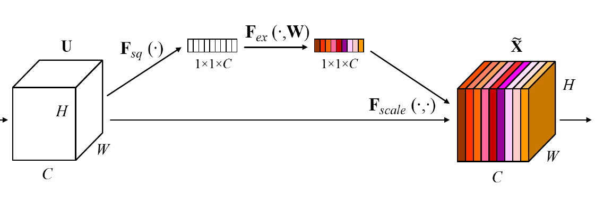

## SE-Block（SE模块）

SE模块是这篇论文的主要创新点。该模块的运作方法并不复杂。其步骤如下：

1. 接收$U$作为输入，对$U$做全局平均池化（Global Average  Pooling，原论文中称之为**Squeeze过程**，图中标记为$F_{sq}(・)$），得到一个$1\times 1\times C$的特征向量。
2. 将得到的长条状特征向量输入一个两层的全连接层（原文中称为**Excitation过程**，图中标记为$F_{ex}(・,W)$），得到一个大小不变的特征向量，并使用$sigmoid$限制到$[0,1]$的范围内（原论文称之为self-gating mechanism）。
3. 对于得到的特征向量，将其与最初输入$U$的各个$Channel$一一对应，并将其直接作为scale乘进$U$中（图中标记为$F_{scale}(・,・)$）。

这样做的理论依据是为了对channel-wise进行重要性采样。或者换个说法，就是把重要的特征增强，不重要的特征减弱，从而让提取的特征指向性更强。

上图是对SEBlock处理过程的描述。

---

## Squeeze过程的设计细节

图中的$F_{sq}(・)$称为**Squeeze过程**，全局平均池化(Global average pooling，GAP)有很多算法，作者用了最简单的求平均的方法：
$$
z_c = F_{sq}(u_c) = \frac{1}{W\times H}\sum_{i=1}^W\sum_{j=1}^H{u_c(i,j)}
$$
这使空间上所有点的信息都平均成了一个值。这么做是因为最终的scale是对整个通道作用的，这就得基于通道的整体信息来计算scale。另外作者要利用的是通道间的相关性，而不是空间分布中的相关性，用GAP屏蔽掉空间上的分布信息能让scale的计算更加准确。

## Excitation过程的设计细节

Excitation部分的设计是为了利用**通道相关性**，详见下文中通道相关性部分。

图中的$F_{ex}(・,W)$称为**Excitation过程**，在SEBlock中这部分是用2个全连接来实现的。众所周知，全连接的计算量是非常恐怖的。层间连接数量较大时。所以，在SENet中第一个全连接把$C$个通道压缩成了$C/r$个通道来降低计算量（后面跟了$relu$），第二个全连接再恢复回$C$个通道（后面跟了$sigmoid$）。原论文中尝试了$r$在各种取值下的性能 ，最后得出结论$r=16$时整体性能和计算量较为平衡。

## 通道相关性

上述的Excitation过程是SENet能够利用通道相关性的关键设计。这种设计训练了一个全连接网络，该全连接网络在整个数据集上得出一个合适的$scale$，作用于前序网络的输出。这种设计是必要的：

例如，在上图存在过程1和过程2，过程1不经过全连接直接将$scale$作用于前序网络的输出。没有了全连接层，某个通道的调整值完全基于单个通道全局平均池化(Global average pooling，GAP)的结果，事实上只有GAP的分支是完全没有反向计算、没有训练的过程的，就无法基于全部数据集来训练得出通道增强、减弱的规律。

而过程2是SENet的做法。为什么要加全连接层呢？这里的全连接层旨在更好地捕获通道间的相关关系。为了实现这个目标，函数必须满足两个标准：

1. 它必须能够学习通道间的非线性关系。通道之间会存在关系。
2. 它必须能够学习一种非互斥的关系。因为有用的也许是多个通道。

为了满足这些标准，SENet选用带有$Sigmoid$激活的简单门控机制，利用通道间的相关性训练出真正的$scale$。一次mini-batch个样本的$squeeze$输出并不代表通道真实要调整的$scale$值，真实的scale要基于全部数据集来训练得出，而不是基于单个batch。

还有一个关键问题是：**实际上，单纯通过卷积训练出的权值也有类似$scale$的成分，为什么要加入这个通道相关性的设计呢**？SENet这样设计是为了**排除空间上的干扰**。在经过GAP后，某一个channel上具有的空间信息被压缩成一个点，从而失去了空间相关性，也就排除了空间上的干扰。

## Summary

SENet的设计兼顾了空间相关性（通过1/8下采样的卷积）和通道相关性（通过Excitation的设计）。这种设计把重要通道的特征强化，非重要通道的特征弱化，得到了很好的效果，这是一种全新的思路，在这个方向上将来可能会有更多的成果。这种设计在当时产生了非常大的进步，证明了通道相关性的重要性。

这种设计也能很轻易地运用到其他网络中：

例如，在上图中，左侧是SE-Inception的结构，即Inception模块和SENet组和在一起；右侧是SE-ResNet，ResNet和SENet的组合，这种结构scale放到了残差的直连相加之前。

