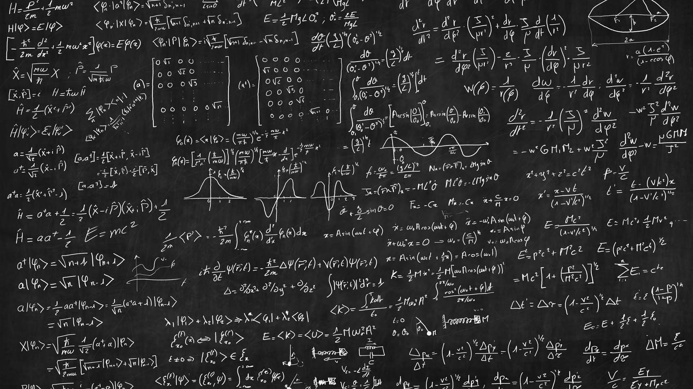

# 损失函数们

> 损失函数（loss function）或代价函数（cost function）是将随机事件或其有关随机变量的取值映射为非负实数以表示该随机事件的“风险”或“损失”的函数。 在应用中，损失函数通常作为学习准则与优化问题相联系，即通过最小化损失函数求解和评估模型。

首先我们对三个名词进行说明：

- 损失函数（Loss function）用于定义单个训练样本与真实值之间的误差。

- 代价函数（Cost function）用于定义单个批次或整个训练集样本与真实值之间的误差。

- 目标函数（Objective function）则泛指任意可以被优化的函数。

在机器学习中，损失函数是代价函数的一部分，用于衡量模型所作出的预测离真实值（Ground Truth）之间的偏离程度；而代价函数则是目标函数的一种类型。通常，我们都会最小化目标函数，最常用的算法便是 **“梯度下降法”（Gradient Descent）**。

实际上，目标函数大都是针对某种任务提出的，并没有一种万能的损失函数能够适用于所有的机器学习任务，所以在这里我们需要知道每一种损失函数的优点和局限性，才能更好的利用它们去解决实际的问题。损失函数大致可分为两种：**回归损失**（针对**连续型**变量）和**分类损失**（针对**离散型**变量）。	

## 回归损失（Regression Loss）

### $L_1$ Loss

也称为**Mean Absolute Error**，即平均绝对误差（MAE），它衡量的是预测值与真实值之间距离的平均误差幅度，作用范围为0到正无穷。
$$
L_1 = |f(x)-Y|
$$
导数：
$$
L_1' = \begin{cases}
-f'(x)& \text{f(x)<0}\\
f'(x)& \text{otherwise}
\end{cases}
$$

优点： 收敛速度快，能够对梯度给予合适的惩罚权重，而不是“一视同仁”，使梯度更新的方向可以更加精确。

缺点： 对异常值十分敏感，梯度更新的方向很容易受离群点所主导，不具备鲁棒性。

### $L_2$ Loss

也称为**Mean Squred Error**，即均方差（**MSE**），它衡量的是预测值与真实1值之间距离的平方和，作用范围同为0到正无穷。
$$
L_2 = |f(x)-Y|^2
$$
导数：
$$
L_2' = 2f'(x)(f(x)-Y)
$$
优点：对离群点（**Outliers**）或者异常值更具有鲁棒性。

缺点：由图可知其在0点处的导数不连续，使得求解效率低下，导致收敛速度慢；而对于较小的损失值，其梯度也同其他区间损失值的梯度一样大，所以不利于网络的学习。

###  Smooth $L_1$ Loss

即平滑的$L_1$损失（SLL），出自Fast RCNN [7]。SLL通过综合$L_1$和$L_2$损失的优点，在0点处附近采用了$L_2$损失中的平方函数，解决了$L_1$损失在0点处梯度不可导的问题，使其更加平滑易于收敛。此外，在|x|>1的区间上，它又采用了$L_1$损失中的线性函数，使得梯度能够快速下降。
$$
L_{1_{smooth}}(x) = \begin{cases}
0.5x^2& \text{|x|<1}\\
|x|-0.5& \text{otherwise}
\end{cases}
$$
导数：
$$
L_{1_{smooth}}' =\begin{cases}
x& \text{|x|<1}\\
-1& \text{x< -1}\\
1& \text{x>1}
\end{cases}
$$
L1损失的导数为常数，如果不及时调整学习率，那么当值过小时，会导致模型很难收敛到一个较高的精度，而是趋向于一个固定值附近波动。反过来，对于L2损失来说，由于在训练初期值较大时，其导数值也会相应较大，导致训练不稳定。最后，可以发现Smooth L1在训练初期输入数值较大时能够较为稳定在某一个数值，而在后期趋向于收敛时也能够加速梯度的回传，很好的解决了前面两者所存在的问题。

### IoU Loss

即交并比损失，出自UnitBox，由旷视科技于ACM2016首次提出。常规的$L_{\cdot}$型损失中，都是基于目标边界中的4个坐标点信息之间分别进行回归损失计算的。因此，这些边框信息之间是相互**独立**的。然而，直观上来看，这些边框信息之间必然是存在某种**相关性**的。

上图中，绿色框代表Ground Truth，蓝色框代表Prediction。显然**重叠度**越高的预测框是越合理的。IoU Loss的核心是一个被称为IoU（Intersection over Union）的表达式：
$$
IoU = \frac{|B\cap B^{gt}|}{|B\cup B^{gt}|}
$$
该表达式是一种度量框的重叠程度的公式。为了解决IoU度量不可导的现象，引入了负Ln范数来间接计算IoU Loss：
$$
Loss_{IOU} = -Ln(IoU) = -Ln \frac{|B\cap B^{gt}|}{|B\cup B^{gt}|}
$$
在应用中，也出现了其他Iou的计算形式：
$$
Loss_{IOU} = 1- IoU = 1- \frac{|B\cap B^{gt}|}{|B\cup B^{gt}|}
$$
IoU损失将候选框的四个边界信息作为一个**整体**进行回归，从而实现准确、高效的定位，具有很好的**尺度不变性**（IoU的值总在$[0,1]$之间）。

### GIoU Loss

上文中的IoU Loss存在一个问题，就是IoU Loss只能衡量prediction和ground truth有重叠的情况：

例在上图中，IoU Loss只能衡量图1中的情况。对于图2和图3中的情况，其Loss值是一样的。例如，当采用$Loss_{IOU} = -Ln(IoU) = -Ln \frac{|B\cap B^{gt}|}{|B\cup B^{gt}|}$的情况，由于两个框交集（IoU的分子）为0，上式的值永远为$+\infin$。再例如，当采用$Loss_{IOU} = 1- IoU = 1- \frac{|B\cap B^{gt}|}{|B\cup B^{gt}|}$的情况，由于两个框的交集（IoU的分子）为0，上式的值永远为$0$。这会导致出现梯度消失的现象，致使网络无法给出一个**优化的方向**。

也就是说，当两个框未出现交集时，IoU Loss将无法量化其距离造成的差距。在直观上，虽然并未出现交集，但两个框的距离较大时，Loss应该更大才对，这样有利于更好地更新梯度。

GIoU（Generalized Intersection over Union）即泛化的IoU（由斯坦福学者于CVPR2019的[论文](https://arxiv.org/abs/1902.09630)中提出），能够解决这个问题：

在上图中，绿色的实线框表示ground truth，黑色的实线框表示prediction，黑色的虚线框表示**两个框的最小闭区域面积**（可通俗理解为同时包含了预测框和真实框的最小框的面积），记为$C$。则：
$$
GIoU = IoU - \frac{|C\setminus(B\cup B^{gt})|}{|C|}
$$
上式中$|C\setminus(B\cup B^{gt})|$表示$C$中除了$B$和$B^{gt}$的部分，$\setminus$是差集符号。

与IoU Loss的设计类似，GIoU Loss可以设计为：
$$
Loss_{GIoU} = 1-GIoU
$$
和IoU一样，GIoU也具有scale不敏感的特性，在两个框完全重合的情况下，$IoU = GIoU = 1$。不同的是，IoU的取值范围是$[0,1]$，而GIoU的取值是$[-1,1]$的对称区间。与IoU只关注重叠区域不同，**GIoU不仅关注重叠区域，还关注其他的非重合区域**，能更好的反映两者的重合度。

### CIoU Loss

### DIoU Loss

### CDIoU Loss

### F-EIoU Loss

## 分类损失（Classification Loss）

### Entropy

### Cross Entropy

### K-L Divergence

### Dice Loss

### Focal Loss

### Tversky loss

