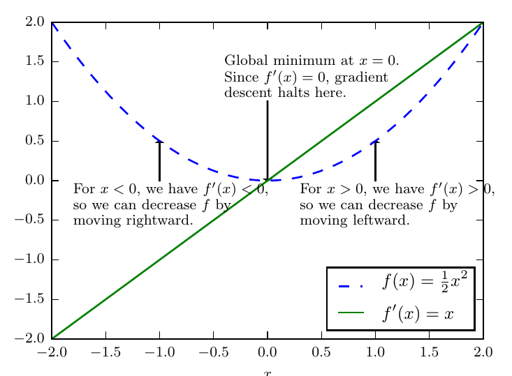

# 自动求梯度

```python
import tensorflow as tf
print(tf.__version__)

# import os
# os.environ['TF_CPP_MIN_LOG_LEVEL'] = '2'
# tf.test.is_gpu_available( cuda_only=False, min_cuda_compute_capability=None )
```

    2.0.0

在深度学习中，我们经常需要对函数求梯度（gradient）。本节将介基于梯度的优化方法和如何使用tensorflow2.0提供的GradientTape来自动求梯度。阅读本节，请确保你对微积分有一定的掌握。

## 基于梯度的优化方法

大多数深度学习算法都涉及某种形式的优化。优化指的是改变 $x$ 以最小化或最大化某个函数 $f (x)$ 的任务。我们通常以最小化 $f (x)$ 指代大多数最优化问题。最大化可经由最小化算法最小化 $−f (x)$​ 来实现。

我们把要最小化或最大化的函数称为**目标函数(objective function)**或准则(criterion)。当我们对其进行最小化时，我们也把它称为代价函数(cost function)、**损失函数(loss function)**或误差函数(error function)。我们通常使用一个上标$*$表示最小化或最大化函数的$x$值。如我们记$ x^* =arg min f (x)$​​​。

假设我们有一个函数 $y = f (x)$，其中 $x$ 和 $y$ 是实数。这个函数的 导数(derivative)记为 $f'(x)$ 或$\frac{dy}{dx}$ 。导数 $f'(x)$代表$f (x)$在点$x$处的斜率。换句话说,它表明如何缩放输入的小变化才能在输出获得相应的变化:$f (x + \epsilon) \approx f (x) + \epsilon f'(x)$。

因此导数对于最小化一个函数很有用,因为它告诉我们如何更改 x 来略微地改善$y$​。例如,我们知道对于足够小的$\epsilon$​来说,$f (x − \epsilon sign(f'(x)))$​ 是比$f (x)$​小的。因此我们可以将$x$​往导数的反方向移动一小步来减小$f (x)$​。这种技术被称为 梯度下降(gradient descent)。



上图为梯度下降的一种示意。梯度下降算法如何使用函数导数的示意图,即沿着函数的下坡方向(导数反方向)直到最小。

当$f'(x) = 0$，导数无法提供往哪个方向移动的信息。$f'(x)=0$的点称为临界点(critical point)或驻点(stationary point)。一个局部极小点(local minimum)意味着这个点的$ f(x)$ 小于所有邻近点,因此不可能通过移动无穷小的步长来减小$f(x)$。一个局部极大点(local maximum)意味着这个点的$f(x)$大于所有邻近点,因此不可能通过移动无穷小的步长来增大$f(x)$​。有些临界点既不是最小点也不是最大点，这些点被称为鞍点(saddle point)。


## 简单示例

我们先看一个简单例子：对函数 $y = 2\boldsymbol{x}^{\top}\boldsymbol{x}$ 求关于列向量 $\boldsymbol{x}$ 的梯度。我们先创建变量`x`，并赋初值。


```python
x = tf.reshape(tf.Variable(range(4), dtype=tf.float32),(4,1))
x
```

    <tf.Tensor: id=10, shape=(4, 1), dtype=float32, numpy=
    array([[0.],
           [1.],
           [2.],
           [3.]], dtype=float32)>

函数 $y = 2\boldsymbol{x}^{\top}\boldsymbol{x}$ 关于$\boldsymbol{x}$ 的梯度应为$4\boldsymbol{x}$。现在我们来验证一下求出来的梯度是正确的。

```python
with tf.GradientTape() as t:
    t.watch(x)
    y = 2 * tf.matmul(tf.transpose(x), x)
    
dy_dx = t.gradient(y, x)
dy_dx
```

    <tf.Tensor: id=30, shape=(4, 1), dtype=float32, numpy=
    array([[ 0.],
           [ 4.],
           [ 8.],
           [12.]], dtype=float32)>

## 训练模式和预测模式

```python
with tf.GradientTape(persistent=True) as g:
    g.watch(x)
    y = x * x
    z = y * y
    dz_dx = g.gradient(z, x)  # 108.0 (4*x^3 at x = 3)
    dy_dx = g.gradient(y, x)  # 6.0
dz_dx,dy_dx
```

    WARNING:tensorflow:Calling GradientTape.gradient on a persistent tape inside its context is significantly less efficient than calling it outside the context (it causes the gradient ops to be recorded on the tape, leading to increased CPU and memory usage). Only call GradientTape.gradient inside the context if you actually want to trace the gradient in order to compute higher order derivatives.
    WARNING:tensorflow:Calling GradientTape.gradient on a persistent tape inside its context is significantly less efficient than calling it outside the context (it causes the gradient ops to be recorded on the tape, leading to increased CPU and memory usage). Only call GradientTape.gradient inside the context if you actually want to trace the gradient in order to compute higher order derivatives.
    
    (<tf.Tensor: id=41, shape=(4, 1), dtype=float32, numpy=
     array([[  0.],
            [  4.],
            [ 32.],
            [108.]], dtype=float32)>,
     <tf.Tensor: id=47, shape=(4, 1), dtype=float32, numpy=
     array([[0.],
            [2.],
            [4.],
            [6.]], dtype=float32)>)

## 对Python控制流求梯度

即使函数的计算图包含了Python的控制流（如条件和循环控制），我们也有可能对变量求梯度。

考虑下面程序，其中包含Python的条件和循环控制。需要强调的是，这里循环（while循环）迭代的次数和条件判断（if语句）的执行都取决于输入a的值。

```python
def f(a):
    b = a * 2
    while tf.norm(b) < 1000:
        b = b * 2
    if tf.reduce_sum(b) > 0:
        c = b
    else:
        c = 100 * b
    return c
```

我们来分析一下上面定义的`f`函数。事实上，给定任意输入`a`，其输出必然是 `f(a) = x * a`的形式，其中标量系数`x`的值取决于输入`a`。由于`c = f(a)`有关`a`的梯度为`x`，且值为`c / a`，我们可以像下面这样验证对本例中控制流求梯度的结果的正确性。

```python
a = tf.random.normal((1,1),dtype=tf.float32)
with tf.GradientTape() as t:
    t.watch(a)
    c = f(a)
t.gradient(c,a) == c/a
```

    <tf.Tensor: id=201, shape=(1, 1), dtype=bool, numpy=array([[ True]])>