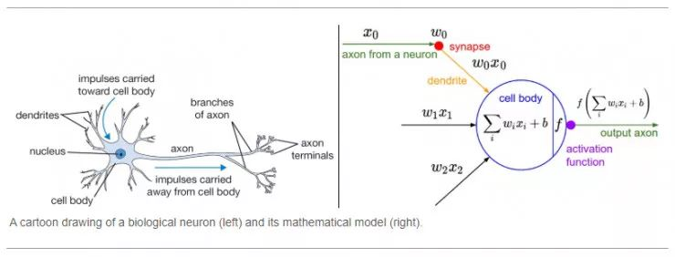

# 激活函数

在之前的[多层感知机](./[1]multilayer-perceptron)一节中，我们提过，在没有激活函数的全连接层中，只是对数据做了仿射变换（affine transformation），而多个仿射变换的叠加仍然是一个仿射变换。解决问题的一个方法是引入非线性变换，这个非线性函数被称为激活函数（activation function）。

如果你还记得高中生物所学的内容，一个神经突触上的受体接受到来自上一个突触的神经递质，当量达到一定时，这个神经元就会处于触发态。在神经网络中也存在这样的机制：激活函数的一些机能决定了某个神经元是否被激活，判断该神经元获得的信息是否有用，并决定该保留还是该去掉此神经元。

对于激活函数，我们主要了解以下几点：

- 激活函数是什么，它在网络中有什么作用？
- 理想的激活函数有哪些特征？
- 目前使用的各种非线性函数。
- 在深层神经网络中应该使用哪些激活函数以及如何使用它们？
- 在最新研究中涌现的值得关注的非线性激活函数。

我们从第一个开始说明。

---

## 激活函数的作用

简单地说，激活函数就是加入到人工神经网络中的一个函数，目的在于帮助神经网络从数据中学习复杂模式。激活函数的作用可以简述为以下几方面：

1. 生物学方面的相似性
2. 引入非线性变换
3. 限定神经元的值域

### 生物学方面的相似性

相比于人类大脑中基于神经元的模型，激活函数是决定向下一个神经元传递何种信息的单元，这也正是激活函数在人工神经网络中的作用。激活函数接收前一个单元输出的信号，并将其转换成某种可以被下一个单元接收的形式。

上图来自斯坦福大学的cs231n课程。

### 引入非线性变换

在之前的[多层感知机](./[1]multilayer-perceptron)一节中，我们提过，在没有激活函数的全连接层中，只是对数据做了仿射变换（affine transformation），而多个仿射变换的叠加仍然是一个仿射变换。

我们先来看一种含单隐藏层的多层感知机的设计。其输出$\boldsymbol{O} \in \mathbb{R}^{n \times q}$的计算为
$$
\begin{split}\begin{aligned} \boldsymbol{H} &= \boldsymbol{X} \boldsymbol{W}_h + \boldsymbol{b}_h,\\ \boldsymbol{O} &= \boldsymbol{H} \boldsymbol{W}_o + \boldsymbol{b}_o, \end{aligned}\end{split}
$$
也就是将隐藏层的输出直接作为输出层的输入。如果将以上两个式子联立起来，可以得到
$$
\boldsymbol{O} = (\boldsymbol{X} \boldsymbol{W}_h + \boldsymbol{b}_h)\boldsymbol{W}_o + \boldsymbol{b}_o = \boldsymbol{X} \boldsymbol{W}_h\boldsymbol{W}_o + \boldsymbol{b}_h \boldsymbol{W}_o + \boldsymbol{b}_o.
$$
从联立后的式子可以看出，虽然在多层感知机中引入了隐藏层，网络却依然等价于一个单层神经网络：其中输出层权重参数为$\boldsymbol{W}_h\boldsymbol{W}_o$，偏差参数为$\boldsymbol{b}_h \boldsymbol{W}_o + \boldsymbol{b}_o$。不难发现，即便再添加更多的隐藏层，以上设计依然只能与仅含输出层的单层神经网络等价。

所以要引入一个非线性的变换，使神经网络的表达能力更强，能够拟合更加复杂的问题。

### 限定神经元的值域

如果神经网络中某个神经节点输出值不被限定在某个范围内，它可能会变得非常大，特别是在具有数百万个参数的深层神经网络中，从而导致计算难度提高。例如，有一些激活函数（如`softmax`）对于不同的输入值（0 或 1）会输出特定的值。

softmax运算通过下式将输出值变换成值为正且和为1的概率分布：

$$
\hat{y}_1, \hat{y}_2, \hat{y}_3 = \text{softmax}(o_1, o_2, o_3),
$$

其中：

$$
\hat{y}_1 = \frac{ \exp(o_1)}{\sum_{i=1}^3 \exp(o_i)},\quad
\hat{y}_2 = \frac{ \exp(o_2)}{\sum_{i=1}^3 \exp(o_i)},\quad
\hat{y}_3 = \frac{ \exp(o_3)}{\sum_{i=1}^3 \exp(o_i)}.
$$

容易看出$\hat{y}_1 + \hat{y}_2 + \hat{y}_3 = 1$且$0 \leq \hat{y}_1, \hat{y}_2, \hat{y}_3 \leq 1$，因此$\hat{y}_1, \hat{y}_2, \hat{y}_3$是一个合法的概率分布。这时候，如果$\hat{y}_2=0.8$，不管$\hat{y_1}$和$\hat{y_3}$的值是多少，我们都知道图像类别为猫的概率是80%。此外，我们注意到：

$$
\operatorname*{argmax}_i o_i = \operatorname*{argmax}_i \hat y_i,
$$

因此softmax运算不改变预测类别输出。

---

## 激活函数具有的特点

### 可能导致梯度消失

很多深度神经网络是利用梯度下降的方法来训练的。梯度下降由基于链式规则的反向传播组成，链式规则用于获取权值变化以减少每次训练后的损失。

考虑一个两层的神经网络，第一层表示为$f{(x)}$，是一个全连接层，第二层表示为$g{(x)}$，是一个激活函数层。因此整个网络可以表示为：
$$
O(x) = g(f(x))
$$
当反向传播时，我们对整个网络求导：
$$
\partial{O} = \frac{\partial{g}}{\partial{f}}\cdot\frac{\partial{f}}{\partial{x}}
$$
我们可以将第一个网络层$f(x)$简要写为：
$$
f(x) = (w x + b)
$$
所以上述求导$\partial{O}$可以写为：

呃，坏了，我忘了是怎么推了....

### 可微

如前所述，神经网络使用梯度下降过程进行训练，因此模型中的层需要可微或至少部分可微。这是一个函数可以作为激活函数层的必要条件。

### 值域常以零为中心

激活函数的输出应对称于零，这样梯度就不会向特定方向移动。

### 计算开销是重要指标

网络的每一层都会应用激活函数，它在深层网络中需要计算数百万次。因此，激活函数的计算成本应该很低。

