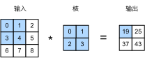

# 	卷积和代码实现

```python
import tensorflow as tf
import numpy as np
```

## 二维互相关运算的实现

回顾之前所讲的互相关运算的大致过程：

在二维互相关运算中，卷积窗口从输入数组的最左上方开始，按从左往右、从上往下的顺序，依次在输入数组上滑动。当卷积窗口滑动到某一位置时，窗口中的输入子数组与核数组按元素相乘并求和，得到输出数组中相应位置的元素。图5.1中的输出数组高和宽分别为2，其中的4个元素由二维互相关运算得出：

$$
0\times0+1\times1+3\times2+4\times3=19,\\
1\times0+2\times1+4\times2+5\times3=25,\\
3\times0+4\times1+6\times2+7\times3=37,\\
4\times0+5\times1+7\times2+8\times3=43.\\
$$

下面我们将上述过程用函数实现，它接受输入数组`X`与核数组`K`，并输出数组`Y`：

````python
def corr2d(X, K):
    h, w = K.shape
    Y = tf.Variable(tf.zeros((X.shape[0] - h + 1, X.shape[1] - w +1)))
    for i in range(Y.shape[0]):
        for j in range(Y.shape[1]):
            Y[i,j].assign(tf.cast(tf.reduce_sum(X[i:i+h, j:j+w] * K), dtype=tf.float32))
    return Y
````

我们可以构造图中的输入数组`X`、核数组`K`来验证二维互相关运算的输出：




```python
X = tf.constant([[0,1,2], [3,4,5], [6,7,8]])
K = tf.constant([[0,1], [2,3]])
corr2d(X, K)
```

输出内容：


    <tf.Variable 'Variable:0' shape=(2, 2) dtype=float32, numpy=
    array([[19., 25.],
           [37., 43.]], dtype=float32)>

## 二维卷积运算

二维卷积层将输入和卷积核做互相关运算，并加上一个标量偏差来得到输出。卷积层的模型参数包括了卷积核和标量偏差。在训练模型的时候，通常我们先对卷积核随机初始化，然后不断迭代卷积核和偏差。

下面基于`corr2d`函数来实现一个自定义的二维卷积层。在构造函数`__init__`里我们声明`weight`和`bias`这两个模型参数。前向计算函数`forward`则是直接调用`corr2d`函数再加上偏差。


```python
class Conv2D(tf.keras.layers.Layer):
    def __init__(self, units):
        super().__init__()
        self.units = units
    
    def build(self, kernel_size):
        self.w = self.add_weight(name='w',
                                shape=kernel_size,
                                initializer=tf.random_normal_initializer())
        self.b = self.add_weight(name='b',
                                shape=(1,),
                                initializer=tf.random_normal_initializer())
    def call(self, inputs):
        return corr2d(inputs, self.w) + self.b
```

卷积窗口形状为$p \times q$的卷积层称为$p \times q$卷积层。同样，$p \times q$卷积或$p \times q$卷积核说明卷积核的高和宽分别为$p$和$q$。

## 卷积的用途

卷积运算在计算机视觉中可以将图片中的特征提取出来，比如，物体的边缘。接下来我们尝试使用卷积提取物体的边缘，即找到像素变化的位置：

首先我们构造一张$6\times 8$的图像（即高和宽分别为6像素和8像素的图像）。它中间4列为黑（0），其余为白（1）。


```python
X = tf.Variable(tf.ones((6,8)))
X[:, 2:6].assign(tf.zeros(X[:,2:6].shape))
X
```

输出：


    <tf.Variable 'Variable:0' shape=(6, 8) dtype=float32, numpy=
    array([[1., 1., 0., 0., 0., 0., 1., 1.],
           [1., 1., 0., 0., 0., 0., 1., 1.],
           [1., 1., 0., 0., 0., 0., 1., 1.],
           [1., 1., 0., 0., 0., 0., 1., 1.],
           [1., 1., 0., 0., 0., 0., 1., 1.],
           [1., 1., 0., 0., 0., 0., 1., 1.]], dtype=float32)>

然后我们构造一个高和宽分别为1和2的卷积核`K`。当它与输入做互相关运算时，如果横向相邻元素相同，输出为0；否则输出为非0。


```python
K = tf.constant([[1,-1]], dtype = tf.float32)
```

下面将输入`X`和我们设计的卷积核`K`做互相关运算。可以看出，我们将从白到黑的边缘和从黑到白的边缘分别检测成了1和-1。其余部分的输出全是0。


```python
Y = corr2d(X, K)
Y
```

输出：


    <tf.Variable 'Variable:0' shape=(6, 7) dtype=float32, numpy=
    array([[ 0.,  1.,  0.,  0.,  0., -1.,  0.],
           [ 0.,  1.,  0.,  0.,  0., -1.,  0.],
           [ 0.,  1.,  0.,  0.,  0., -1.,  0.],
           [ 0.,  1.,  0.,  0.,  0., -1.,  0.],
           [ 0.,  1.,  0.,  0.,  0., -1.,  0.],
           [ 0.,  1.,  0.,  0.,  0., -1.,  0.]], dtype=float32)>

由此，我们可以看出，卷积层可通过重复使用卷积核有效地表征局部空间。

## 通过数据学习核数组

最后我们来看一个例子，它使用物体边缘检测中的输入数据`X`和输出数据`Y`来学习我们构造的核数组`K`。我们首先构造一个卷积层，将其卷积核初始化成随机数组。接下来在每一次迭代中，我们使用平方误差来比较`Y`和卷积层的输出，然后计算梯度来更新权重。简单起见，这里的卷积层忽略了偏差。

虽然我们之前构造了`Conv2D`类，但由于`corr2d`使用了对单个元素赋值（`[i, j]=`）的操作因而无法自动求梯度。下面我们使用tf.keras.layers提供的`Conv2D`类来实现这个例子。


```python
# 二维卷积层使用4维输入输出，格式为(样本, 高, 宽, 通道)，这里批量大小（批量中的样本数）和通道数均为1
X = tf.reshape(X, (1,6,8,1))
Y = tf.reshape(Y, (1,6,7,1))
Y

# 构造一个输出通道数为1（将在“多输入通道和多输出通道”一节介绍通道），核数组形状是(1, 2)的二维卷积层
conv2d = tf.keras.layers.Conv2D(1, (1,2))
#input_shape = (samples, rows, cols, channels)
# Y = conv2d(X)
Y_hat = conv2d(X)
for i in range(10):
    with tf.GradientTape(watch_accessed_variables=False) as g:
        g.watch(conv2d.weights[0])
        Y_hat = conv2d(X)
        l = (abs(Y_hat - Y)) ** 2
        dl = g.gradient(l, conv2d.weights[0])
        lr = 3e-2
        update = tf.multiply(lr, dl)
        updated_weights = conv2d.get_weights()
        updated_weights[0] = conv2d.weights[0] - update
        conv2d.set_weights(updated_weights)  
        
        if (i + 1)% 2 == 0:
            print('batch %d, loss %.3f' % (i + 1, tf.reduce_sum(l)))
```

输出：

    batch 2, loss 0.235
    batch 4, loss 0.041
    batch 6, loss 0.008
    batch 8, loss 0.002
    batch 10, loss 0.000


可以看到，10次迭代后误差已经降到了一个比较小的值。现在来看一下学习到的核数组。


```python
tf.reshape(conv2d.get_weights()[0],(1,2))
```

输出：


    <tf.Tensor: id=1012, shape=(1, 2), dtype=float32, numpy=array([[ 0.99903595, -0.9960023 ]], dtype=float32)>=

可以看到，学到的核数组与我们之前定义的核数组`K`较接近。

