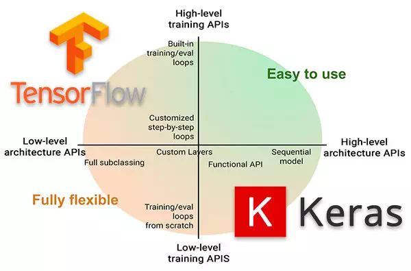
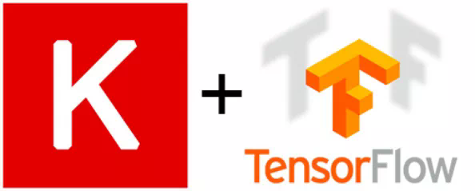

# 新玩具：Keras API

这篇文章插在经典论文讲解和复现中间，其实是为了向初学者说明：

- 什么是Keras
- 为什么使用Keras

也许你已经听说过Keras了。Keras是一个用Python编写的开源神经网络库，能够在TensorFlow、Microsoft Cognitive Toolkit、Theano或PlaidML之上运行。Keras旨在快速实现深度神经网络，专注于用户友好、模块化和可扩展性。 也就是说，Keras被认为是一个接口，而非独立的机器学习框架。它提供了更高级别、更直观的抽象集，无论使用何种计算后端，用户都可以轻松地开发深度学习模型

2017年，Google的TensorFlow团队决定在TensorFlow核心库中支持Keras。TensorFlow 2.0 包含了一个完整的生态系统，包括 TensorFlow Lite（用于移动和嵌入式设备）和用于开发生产机器学习流水线的 TensorFlow Extended（用于部署生产模型）。

上面这张图（具有一定时效性）简要的说明了Tensorflow和Keras错综复杂的关系。Keras 和 TensorFlow 之间复杂纠缠的关系就像一对高中情侣的爱情故事，他们约会、分手，但最终找到了一个共处的方式。你可以暂时不了解它们的关系。你只需要知道，现在Tensorflow称为了Keras的默认后端。

**结论就是，现在你安装Tensorflow就一定会安装Keras，安装Keras也一定会按照Tensorflow**。

就如同在[LeNet代码实现](./[2]LeNet-code.md)中提到的两种等效的写法，在代码中大面积使用Keras API能让你的代码变得短小精悍、易读、易于维护。所以，在研究过程中你应该尽量多使用Keras API。在接下来的所有章节中，我也将尽量使用Keras API完成功能。