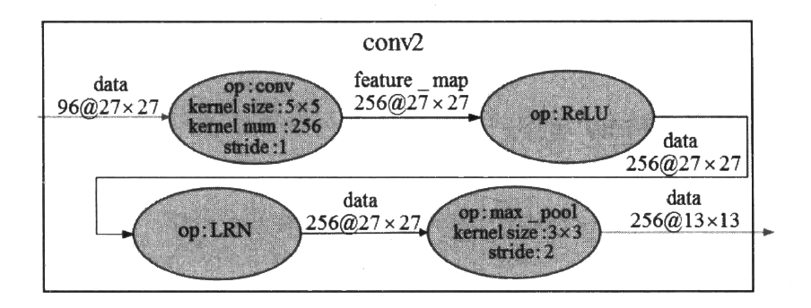
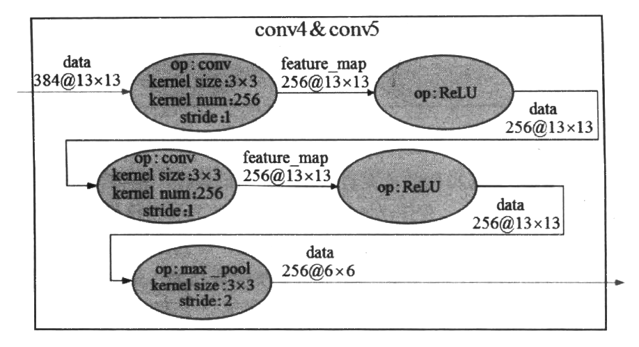

# AlexNet：更深的卷积神经网络

AlexNet是在LeNet的思想基础上将卷积神经网络变得更深的应用。其原论文是[ImageNet Classification with Deep Convolutional Neural Networks](https://papers.nips.cc/paper/2012/file/c399862d3b9d6b76c8436e924a68c45b-Paper.pdf)。

上一节介绍了LeNet-5经典卷积网络模型的构成以及如何实现这样的一个网络，并且在实现的模型上获得了90%以上的正确率，但是LeNet-5缺乏对于更大、更多的图片进行分类的能力(MNIST中图片的分辨率仅为28x28,而通常电子设备捕获的照片至少比这个数值大10倍)。在2012年，Hinton 的学生Alex Krizhevsky借助深度学习的相关理论提出了深度卷积神经网络模型AlexNet。 在2012年的ILSVRC竞赛中(翻阅第1章的深度学习现代应用，那里有更多关于这个大赛的介绍)，AlexNet模型取得了top-5 错误率为15.3%的好成绩，相较于Top-5错误率为16.2%的第二名以明显的优势胜出。从此，AlexNet 成为CNN领域比较有标志性的一个网络模型。

> 警告：如果你在使用GPU运算的话，AlexNet可能需要超过4GB的显存来运行。

相较于LeNet-5，AlexNet算得上是一个进化版本。网络结构的情况是，AlexNet 包含6亿3000万个左右的连接，参数的数量有6000万(60M)左右，神经元单元的数量有大概65万个。卷积层的数量有5个，池化层的数量有3个，也就是说，并不是所有的卷积层后面都连接有池化层。在这些卷积与池化层之后是3个全连层，最后一个全连层的单元数量为1000个，用于完成对ImageNet数据集中的图片完成1000分类(具体分类通过Softmax层实现)。总的来说，AlexNet可以算是神经网络在经历了低谷期之后第一次振聋发聩的发声，运用了深度学习算法的深度神经网络被确立为计算机视觉领域的首选，同时也推动了深度学习在其他领域(如语音识别、自然语言处理等)的发展。

根据2012年Alex Krizhevsky 在NIPS ( Conference and Workshop on Neural Information Processing Systems，神经信息处理系统大会)公开发表的论文《ImageNet classification with deep convolutional neural networks》的内容，AlexNet 网络的基本结构如图所示。


这是原论文对上图的解说：

> Figure 2: An illustration of the architecture of our CNN, explicitly showing the delineation of responsibilities between the two GPUs. One GPU runs the layer-parts at the top of the figure while the other runs the layer-parts at the bottom. The GPUs communicate only at certain layers. The network’s input is 150,528-dimensional, and the number of neurons in the network’s remaining layers is given by 253,440-186,624-64,896-64,896-43,264-4096-4096-1000.

在AlexNet提出的时候，正是通用GPU快速发展的一个阶段，AlexNet也不失时机地利用了GPU强大的并行计算能力。在处理神经网络训练过程中出现的大量矩阵运算时，AlexNet使用了两块GPU(NVIDIA的GTX580)进行训练。单个GTX580只有3GB显存，因为有限的显存会限制可训练的网络的最大规模，所以作者将AlexNet分布在2个GPU上，每个GPU的显存只需要存储一半的神经元的参数即可。因为GPU之间通信方便，可以在不通过主机内存的情况下互相访问显存，所以同时使用多块GPU也是非常高效的。另外，AlexNet 的2个子网络并不是在所有的层之间都存在通信，这样设计在降低GPU之间通信的性能损耗方面也做出了贡献。在上图中可以看出，2个GPU处理同一幅图像，并且在每-层的深度都一致，不计入输入层的话AlexNet共有8层，其中前5层是卷积层(包含有两个最大池化层)，后3层是全连层。

数据增强在模型的训练和测试过程中起到了一定的帮助作用。在训练时，模型会随机地从256*256大小的原始图像中截取224x224 大小的区域，同时还得到了图像进行水平翻转后的镜像，这相当于增加了样本的数量。

## AlexNet模型

接下来，我们看一下AlexNet 网络的一些细节。


由于在下一小节中我们的设计是将整个AlexNet放在一块GPU而不是拆分成两个模型放在两块GPU上运行，所以在介绍这些网络细节时，我们也将AlexNet 看作一个完整的网络。第一段卷积(convl)中，AlexNet 使用96个11x11卷积核对输入的224x224大小且深度为3的图像进行滤波操作，步长stride 参数为4x4，得到的结果是96个55*55的特征图;得到基本的卷积数据后，第二个操作是ReLU去线性化;第三个操作是LRN ( AlexNet首次提出) ;第四个操作是3x3的最大池化，步长为2。图8-3展示了第一-段卷积的大概过程。


第二段卷积(conv2)接收了来自convl输出的数据，也包含4个操作。第一个操作是卷积操作，使用256个5x5深度为3的卷积核，步长stride参数为1x1，得到的结果是256个27x27的特征图;得到基本的卷积数据后，第二个操作也是ReLU去线性化;第三个操作也是LRN;第四个操作是3x3的最大池化，步长为2。图8~4展示了第二段卷积的大概过程。



第三段卷积(conv3) 接收了来自(conv2输出的数据，但是这一层去掉了池化操作和LRN。第一个操作是3x3的卷积操作，核数量为384，步长stride参数为1，得到的结果是384个13x13的特征图;得到基本的卷积数据后，下一个操作是ReLU去线性化。图8-5展示了第三段卷积的大概过程。


第四段卷积与第三段卷积的实现类似，第五段卷积在第四段卷积的基础上增加了一个最大池化操作。关于这两段卷积这里不再细说，图8-6将这两段卷积展示在了一起。



> 注意：AlexNet在原论文中被拆分成两个网络并且放到两个GPU上运行训练，起初的AlexNet是直接使用CUDA代码编写的。在本文之后的代码实现中，仅在一台计算机上实现AlexNet。

---

## 使用代码实现

AlexNet的出现本身就带有很多开创性的特点。ReLU激活函数的提出要比AlexNet还早，但是**在AlexNet之前，并没有关于CNN使用ReLU激活函数获得重大成功的例子**。**一些经典的激活函数，如sigmoid, 会在网络较深时产生梯度弥散的问题**。AlexNet使用ReLU作为CNN的激活函数取得了成功，原因就在于**ReLU激活函数在较深的网络中能够有效地克服sigmoid存在的梯度弥散问题**。

我们一般会在卷积层之后直接添加一个池化层进行处理，但是AlexNet 在卷积层和池化层之间还加入了一个LRN层。LRN（Local Response Normalization，局部相应归一化）层是在AlexNet中首次被提出并运用。对LRN层的描述最早见于Alex 那篇用CNN参加ImageNet比赛的论文，Alex在论文中的解释是:LRN层为了模仿生物神经系统的“侧抑制”机制而对局部神经元的活动创建竞争环境，**这样做会让其中响应比较大的值变得相对更大，并抑制其他响应较小的神经元，能够进一步增强模型的泛化能力**。随后，Alex 在ImageNet数据集上分别测试了添加LRN层的AlexNet以及没有添加LRN层的AlexNet。在两个网络结构完全相同的情况下，他发现使用了LRN层的CNN可以使top-l错误率有1.4%的降低，可以使top-5错误率有1.2%的降低。

> 为了方便，从AlexNet开始，我们大量使用KerasAPI进行快速的代码编写。

导入所需的包：

```python
import tensorflow as tf
from tensorflow.keras import layers, datasets, Sequential
```

这次我们在`cifar10`上训练AlexNet。导入`cifar10`数据集并做一次标准化：

```python
(training_x, training_y), (testing_x, testing_y) = datasets.cifar10.load_data()
training_x = (training_x.astype('float32') / 255.)
testing_x = (testing_x.astype('float32') / 255.)
```

### 定义模型

```python
model = Sequential([
    # 第一层卷积
    layers.Conv2D(filters=96, kernel_size=(3, 3)),
    # 第一层卷积具有BN层
    layers.BatchNormalization(),
    layers.Activation('relu'),
    layers.MaxPool2D(pool_size=(3, 3), strides=2),
    # 第二层卷积
    layers.Conv2D(filters=256, kernel_size=(3, 3)),
    # 第二层卷积具有BN层
    layers.BatchNormalization(),
    layers.Activation('relu'),
    layers.MaxPool2D(pool_size=(3, 3), strides=2),
    # 第三层卷积，并没有BN层，也没有池化
    layers.Conv2D(filters=384, kernel_size=(3, 3), padding='same',
                  activation='relu'),
    # 第四层卷积，并没有BN层，也没有池化
    layers.Conv2D(filters=384, kernel_size=(3, 3), padding='same',
                  activation='relu'),
    # 第五层卷积，并没有BN层
    layers.Conv2D(filters=256, kernel_size=(3, 3), padding='same',
                  activation='relu'),
    layers.MaxPool2D(pool_size=(3, 3), strides=2),
    # 打平进入全连接进行分类
    layers.Flatten(),
    layers.Dense(2048, activation='relu'),
    layers.Dropout(0.5),
    layers.Dense(2048, activation='relu'),
    layers.Dropout(0.5),
    layers.Dense(10, activation='softmax')
])
```

### 训练模型

```python
model.compile(optimizer='adam',
              loss=tf.keras.losses.SparseCategoricalCrossentropy(from_logits=False),
              metrics=['sparse_categorical_accuracy'])

model.fit(training_x, training_y, batch_size=32, epochs=5, validation_data=(testing_x, testing_y))
```

与[之前的LeNet](./[1]LeNet.md)不同的是，AlexNet在训练的时候使用`Cifar10`数据集，图像较大，所以这里将batch size设置为32而不是LeNet中的上百。

训练输出：

```
Epoch 1/5
1563/1563 [==============================] - 89s 57ms/step - loss: 1.6133 - sparse_categorical_accuracy: 0.4115 - val_loss: 1.5746 - val_sparse_categorical_accuracy: 0.4414
Epoch 2/5
1563/1563 [==============================] - 82s 52ms/step - loss: 1.2800 - sparse_categorical_accuracy: 0.5475 - val_loss: 1.2506 - val_sparse_categorical_accuracy: 0.5565
Epoch 3/5
1563/1563 [==============================] - 82s 52ms/step - loss: 1.1405 - sparse_categorical_accuracy: 0.5994 - val_loss: 1.4479 - val_sparse_categorical_accuracy: 0.4983
Epoch 4/5
1563/1563 [==============================] - 83s 53ms/step - loss: 1.0457 - sparse_categorical_accuracy: 0.6391 - val_loss: 1.2161 - val_sparse_categorical_accuracy: 0.5892
Epoch 5/5
1563/1563 [==============================] - 83s 53ms/step - loss: 0.9849 - sparse_categorical_accuracy: 0.6629 - val_loss: 1.1617 - val_sparse_categorical_accuracy: 0.6053
```

由于我在写本节的时候使用一台办公本进行了训练，所以整个训练过程是缓慢的，我只训练了五个epochs就停了下来。但是能观察到，精确度正在逐渐上升。