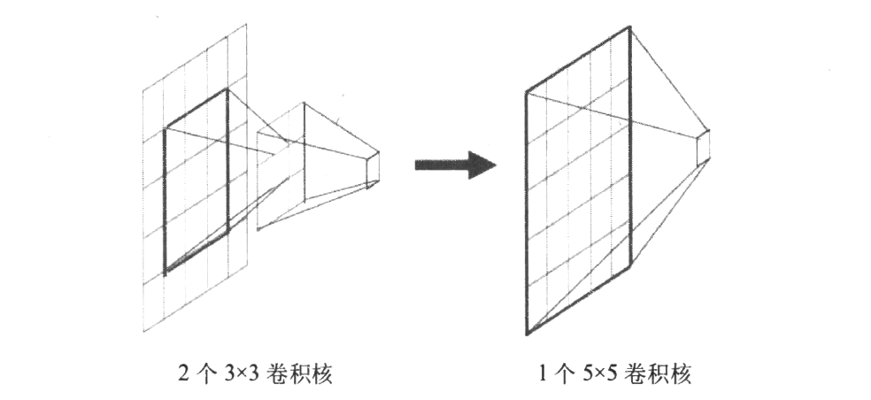
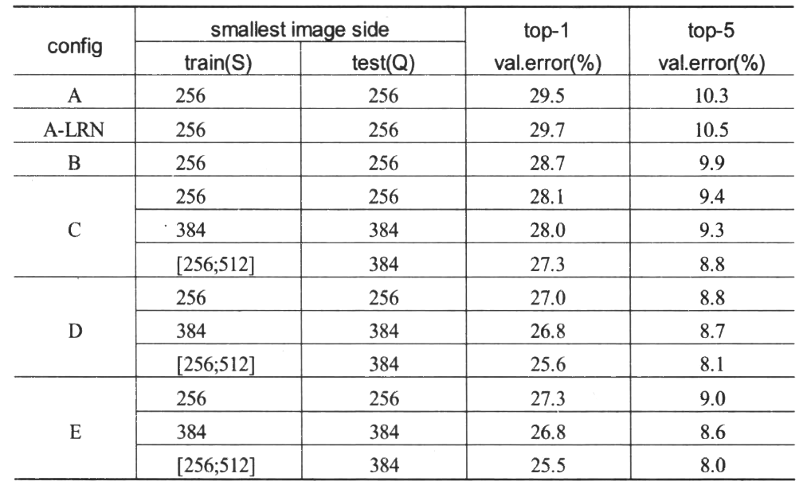
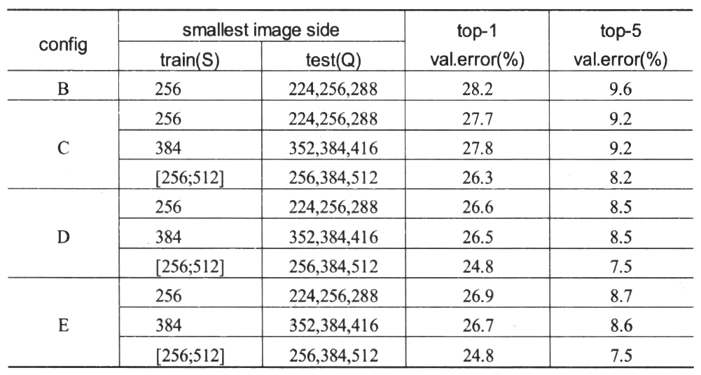

# VGG：可复用的网络块

VGGNet是2014年ILSVRC图像分类竞赛的第二名，其top-5错误率仅为7.3%，具有140M参数。这次竞赛的第一是之后会写到的GoogLeNet，不过事实证明了VGGNet在泛化性方面比GoogLeNet做的更好。此外，VGGNet是特征提取网络的选择中经常出现的选项。作为一个较为早期的工作，VGG的表现很有研究和学习的价值。

VGGNet所对应的原论文是[Very Deep Convolutional Networks for Large-Scale Image Recognition](https://arxiv.org/abs/1409.1556)。以下是这篇论文的摘要：

> In this work we investigate the effect of the convolutional network depth on its accuracy in the large-scale image recognition setting. Our main contribution is a thorough evaluation of networks of increasing depth using an architecture with very small (3x3) convolution filters, which shows that a significant improvement on the prior-art configurations can be achieved by pushing the depth to 16-19 weight layers. These findings were the basis of our ImageNet Challenge 2014 submission, where our team secured the first and the second places in the localisation and classification tracks respectively. We also show that our representations generalise well to other datasets, where they achieve state-of-the-art results. We have made our two best-performing ConvNet models publicly available to facilitate further research on the use of deep visual representations in computer vision.

VGGNet网络模型的起名和这篇论文的名称没有什么关系。它真正的名称来源是创造出它的组织：牛津大学计算机视觉几何组（Visual Geometry Group）的缩写。当然，参与VGG研究工作的其实还有Google DeepMind的一些研究者。

## 网络设计

下图是“许多”VGG的网络结构。没错，“很多”，上图中包含了六种网络结构，分别是`A`、`A-LRN`、`B`、`C`、`D`、`E`。下面的`Table-2`是这六种结构对应的参数量，它们除了最大池化和最后的全连接以外都不有一样。


**VGGNet对卷积神经网络的深度与其性能之间的关系进行了探索**。网络的结构非常简洁，在整个网络中全部使用了大小相同的卷积核（$3\times 3$） 和最大池化核（$2\times 2$）。 通过重复堆叠的方式，**使用这些卷积层和最大池化层成功地搭建了11~19 层深的卷积神经网络**。其中大家熟知的VGG-16是D所示的结构。


VGGNet模型通过不断地加深网络结构来提升性能，牛津大学计算机视觉几何组**对11~19层的网络都进行了详尽的性能测试和参数量评估**。从上图可以看出，随着网络深度的增加，网络的参数量上升并不显著。原因在于大部分参数量都堆在了最后几个全连接层里。卷积的参数共享特性和局部连接特性对降低参数量起到了巨大的作用（参数共享特性和局部连接特性在[这篇文章](../ch2p1/[1]convolutional-nn-and-ops.md)里有提到）。但是由于卷积操作和池化操作的运算相较于全连接更加复杂，所以训练中消耗大部分时间的还是卷积层。

再回到这张图：


可以看出，VGGNet拥有5段卷积，每一段卷积内都有一定数量的卷积层(或1个或4个)，所以是5阶段卷积特征提取。每一段卷积之后都有一个max-pool层，这些最大池化层被用来缩小图片的尺寸。同一段内的卷积层拥有相同的卷积核数，之后每增加一段，该段内卷积层的卷积核数就增长1倍。

这其中有一个很有趣的设计，就是使用堆叠多个$3\times 3$卷积代替一个更大的卷积核卷积。例如下图是一个使用两层$3\times 3$卷积代替一层$5\times 5$卷积的操作：



将多个3x3卷积核的卷积层堆叠在一起是一种非常有趣也非常有用的设计，这对降低卷积核的参数非常有帮助：在下采样特征提取的角度来看，这两者的效果是相同的：两个$3\times 3$卷积或是一个$5\times 5$卷积都会使当前位置的像素和周围$5\times 5$范围内的像素产生关联。

不过两层$3\times 3$卷积产生的参数量（也就是两个核的大小）是$3\times 3\times 2 = 9$，而一个$5\times 5$卷积带来的参数量是$5\times 5 = 25$。同时，这种设计也会加强CNN对特征的学习能力（你可以简单理解为多了一个核，学习能力有所增强）。这种设计可以被推广用来替代更多的层，例如，你可以三层$3\times 3$卷积代替一层$7\times 7$卷积，以此类推。

## 训练和预测技巧

在训练时，VGGNet对数据进行了增广（数据增广在[这篇文章](../ch3p2/[5]image-augmentation.md)有介绍和描述）。这个过程大致就是先将原始的图像缩放到不同尺寸(缩放后的短边长度用S表示，在实践中，一般令S在$[256,512]$这个区间内取值)，然后将得到的图像进行$224\times 224$的随机裁剪。数据增强处理能增加很多数据量，对于防止模型过拟合有很好的效果。因为卷积神经网络对于图像的缩放有一定的不变性，所以将这种经过多尺度缩放裁剪后的图片输入到卷积神经网络中训练可以增加网络的这种不变性。经过Multi-Scale 多尺度缩放裁剪后可以获得多个版本的图像数据。

在预测时，VGGNet 将图像缩放到到一个大于$224\times 224$的尺寸后再裁剪，并将裁剪后的图片输入到卷积网络计算。输入到网络中的图片是某一张图片经过缩放裁剪后的多个样本，这样会得到一张图片的多个分类结果，所以紧接着要做的事就是对这些分类结果进行平均以得到最后这张图片的分类结果。这种平均的方式会提高图片数据的利用率并使分类的效果变好。



上如是没有使用数据增广之前的VGGNet准确率。



上图是使用了数据增广后的VGGNet准确率。

## 代码实现

请注意，这里我们只复现网络结构，不复现数据增广。

首先导入需要的包：

```python
import tensorflow as tf
from tensorflow.keras.layers import Conv2D, BatchNormalization, Activation, MaxPool2D, Dropout, Flatten, Dense
```

然后加载`cifar10`数据集，并做标准化处理：

```python
(x_train, y_train), (x_test, y_test) = tf.keras.datasets.cifar10.load_data()
x_train, x_test = x_train / 255.0, x_test / 255.0
```

### 定义模型

在这里，我们选择复现模型表中的`D`进行复现。

```python
model = tf.keras.Sequential([
    # 卷积层 01
    Conv2D(filters=64, kernel_size=(3, 3), padding='same'),
    BatchNormalization(),  # BN层
    Activation('relu'),  # 激活层
    # 卷积层 02
    Conv2D(filters=64, kernel_size=(3, 3), padding='same', ),
    BatchNormalization(),  # BN层
    Activation('relu'),  # 激活层
    MaxPool2D(pool_size=(2, 2), strides=2, padding='same'),  # 池化层
    Dropout(0.2),  # 丢弃层
    # 卷积层 03
    Conv2D(filters=128, kernel_size=(3, 3), padding='same'),
    BatchNormalization(),  # BN层
    Activation('relu'),  # 激活层
    # 卷积层 04
    Conv2D(filters=128, kernel_size=(3, 3), padding='same'),
    BatchNormalization(),  # BN层
    Activation('relu'),  # 激活层
    MaxPool2D(pool_size=(2, 2), strides=2, padding='same'),  # 池化层
    Dropout(0.2),  # 丢弃层
    # 卷积层 05
    Conv2D(filters=256, kernel_size=(3, 3), padding='same'),
    BatchNormalization(),  # BN层1
    Activation('relu'),  # 激活层1
    # 卷积层 06
    Conv2D(filters=256, kernel_size=(3, 3), padding='same'),
    BatchNormalization(),  # BN层1
    Activation('relu'),  # 激活层1
    Conv2D(filters=256, kernel_size=(3, 3), padding='same'),
    BatchNormalization(),  # BN层1
    Activation('relu'),  # 激活层1
    # 卷积层 07
    MaxPool2D(pool_size=(2, 2), strides=2, padding='same'),  # 池化层
    Dropout(0.2),  # 丢弃层
    Conv2D(filters=512, kernel_size=(3, 3), padding='same'),
    BatchNormalization(),  # BN层
    Activation('relu'),  # 激活层
    # 卷积层 08
    Conv2D(filters=512, kernel_size=(3, 3), padding='same'),
    BatchNormalization(),  # BN层
    Activation('relu'),  # 激活层
    # 卷积层 09
    Conv2D(filters=512, kernel_size=(3, 3), padding='same'),
    BatchNormalization(),  # BN层
    Activation('relu'),  # 激活层
    MaxPool2D(pool_size=(2, 2), strides=2, padding='same'),
    Dropout(0.2),
    # 卷积层 10
    Conv2D(filters=512, kernel_size=(3, 3), padding='same'),
    BatchNormalization(),  # BN层
    Activation('relu'),  # 激活层
    # 卷积层 11
    Conv2D(filters=512, kernel_size=(3, 3), padding='same'),
    BatchNormalization(),  # BN层
    Activation('relu'),  # 激活层
    # 卷积层 12
    Conv2D(filters=512, kernel_size=(3, 3), padding='same'),
    BatchNormalization(),  # BN层
    Activation('relu'),  # 激活层
    MaxPool2D(pool_size=(2, 2), strides=2, padding='same'),  # 池化层
    Dropout(0.2),  # 丢弃层
    # 打平进入全连接
    Flatten(),
    Dense(512, activation='relu'),
    Dropout(0.2),  # 丢弃层
    Dense(512, activation='relu'),
    Dropout(0.2),  # 丢弃层
    Dense(10, activation='softmax')
])
```

### 训练模型

```python
model.compile(optimizer='adam',
              loss=tf.keras.losses.SparseCategoricalCrossentropy(from_logits=False),
              metrics=['sparse_categorical_accuracy'])
model.fit(x_train, y_train, batch_size=32, epochs=5, validation_data=(x_test, y_test))
```

输出结果：

我太难了，今天工作站断网了呜呜呜下次补上输出的结果

