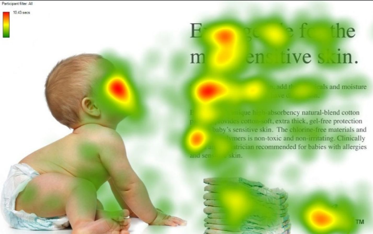
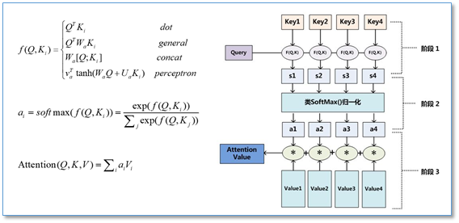

# 注意力机制

注意力机制也可称为注意力模型。

注意力机制在很多AI领域内得到了成功的应用。这是人工神经网络在模仿人类进行决策过程的重要发展。

> In humans, Attention is a core property of all perceptual and cognitive operations. Given our limited ability to process competing sources, attention mechanisms select, modulate, and focus on the information most relevant to behavior.

这段文字摘自Alana de Santana Correia, and Esther Luna Colombini的论文 [ATTENTION, PLEASE ! A SURVEY OF NEURAL ATTENTION MODELS IN DEEP LEARNING](https://arxiv.org/abs/2103.16775)。你应该注意到了，在你的视野中，只有一部分区域是很清晰的。对于视野周围的场景，你往往需要转转眼珠，把视野朝向它，才能完全看清。或者，你还发现，比起历史老师开始强调重点，你似乎对下课铃声的响起更加敏感——这就是注意力。你所处的环境包含着远超你的处理能力的信息，而注意力机制让你的大脑集中精力处理你视野中心的场景，或是你“更应该”关心的事物。

Attention机制听上去是一个很高大上的词汇，实际上，Attention在不经意间就会被使用。例如，循环神经网络中每一步计算都依赖于上一步计算结果的过程就可以被视为一种Attention：在 Attention 机制引入之前，有一个问题大家一直很苦恼：长距离的信息会被弱化，就好像记忆能力弱的人，记不住过去的事情是一样的。

如上图，在处理序列的循环神经网咯中，Attention的功能是关注重点，就算文本比较长，也能从中间抓住重点，不丢失重要的信息。上图中红色的预期就是被挑出来的重点。

## 介绍

Attention机制最早是应用于图像领域，九几年就提出来的思想。在2014年，Google Mind团队发表的论文[Recurrent Models of Visual Attention](https://arxiv.org/abs/1406.6247)使Attention机制开始火了起来，该论文提出在RNN模型上使用Attention机制来进行图像分类，结果取得了很好的性能。随后，在Bahdanau等人发表论文[Neural Machine Translation by Jointly Learning to Align and Translate](https://arxiv.org/abs/1409.0473)中提出在机器翻译任务上使用Attention机制将翻译和对齐同时进行，他们的工作是第一个将Attention机制应用在NLP领域中的。接着，在Xu等人发表的论文[Show, Attend and Tell: Neural Image Caption Generation with Visual Attention](https://arxiv.org/abs/1502.03044)中，成功的将Attention机制应用在Image Caption领域。从此，Attention机制就被广泛应用在基于RNN神经网络模型的各种深度学习任务中。随后，如何在CNN中使用Attention机制也成为研究的热点。2017年，Google发表的论文[Attention is All You Need](https://arxiv.org/abs/1706.03762)中提出在机器翻译上大量使用自注意力（self-attention）机制来学习文本表示。2018 年[BERT: Pre-training of Deep Bidirectional Transformers for Language Understanding](https://arxiv.org/abs/1810.04805)和GPT的效果出奇的好，进而走红。而Transformer和 Attention 这些核心开始被大家重点关注。

Attention具有以下三大优点：参数少、速度快、效果好。

## 不同类型的Attention

Attention机制如果浅层的理解，跟他的名字非常匹配。他的核心逻辑就是**从关注全部到关注重点**。在认知科学中，由于信息处理的瓶颈，人类会选择性地关注所有信息的一部分，同时忽略其他信息。同理，当神经网络处理大量的信息输入时，快速聚焦其中一些关键信息来进行处理，这便是注意力机制。

根据类型的不同，Attention可以被分为：

- 显著性（Saliency-Based）注意力：自下而上的无意识的注意力。

  在很常见的卷积神经网络和循环神经网络中，可以将 **池化（`max pooling`）、门控（`Gating`）** 近似看作是自下而上的基于显著性的注意力机制。自下而上的意思是，这种注意力不需要策略和判断，也不需要经过学习，所以是无意识的。

- 聚焦式（Focus）注意力：自上而下的有意识的注意力。

  这种注意力是需要设计或是经过学习才能产生的，所以称为自上而下的，或称为有意识的。在这一节我们主要对这种自上而下的注意力进行了解。

## 一种初步理解：注意力分布

求注意力分布也就是为了实现选择关键的信息来进行处理。或者说，注意力分布就是关键信息的分布。

例如，人第一眼看到上面的图片，会不自觉地先看到红色的区域。上图中红色到绿色构成的mask就是注意力分布了。

注意力机制的一种可能的流程是这样的可以通过这样的两个步骤实现：

1. 在所有输入信息上计算注意力分布
2. 根据注意力分布计算输入信息的加权和，以此选择关键信息

也就是说，我们设计注意力模块产生注意力（分布），然后让注意力通过某种方式作用于输入，形成更加有效的信息。

#### 注意力分布

为了从输入中选择出和某个特定任务相关的信息，我们需要引入一个和任务相关的表示，称为**查询向量**(Query Vector)，并通过一个**打分函数**来计算**每个输入向量和查询向量之间的相关性**。

给定一个和任务相关的查询向量$q$，我们用 **注意力变量**$z\in [1,N]$来表示被选择信息的索引位置，即$z=i$表示选择了第$i$个输入向量。这里采用`Soft Attention`的方式，即计算在给定$q$和$X$下，选择第$i$个输入向量的概率$\alpha_{i}$：
$$
{\alpha}_{i}=p(z=i|X,q)\\
=softmax(s(x_{i},q))\\
=\frac{exp(s(x_{i},q))}{\sum_{j=1}^{n}exp(s(x_{j},q))}
$$

上式中${\alpha}_{i}$称为注意力分布（Attention Distribution），$s(x_{i},q)$是注意力的打分函数。所谓打分函数，就是计算每个输入量和查询向量之间的相关性的函数。

#### 注意力打分函数

在上文的注意力分布的公式中${\alpha}_{i}$称为注意力分布（Attention Distribution），$s(x_{i},q)$为注意力打分函数， 可以使用以下几种方式来计算：

- 加性模型：$v^{T}tanh(W_{x_i}+Uq)$，其中$W$、$U$、$v$是可训练的参数。
- 点积模型：$x_{i}^{T}q$，理论上，加性模型和点积模型的复杂度差不多，但是点积模型在实现上可以 更好地利用矩阵乘积，从而计算效率更高
- 缩放点积模型：$\frac{x_{i}^{T}q}{\sqrt{d}}$，其中$d$为输入输入向量的维度。当输入向量维度过高，点积模型通常有较大的方差，从而导致softmax函数梯度较小，而缩放点积模型可以很好地解决这个问题。
- 双线性模型：$x_{i}^{T}Wq$，双线性模型可以看作一种更泛化的点积模型，相比点积模型，双线性模型在计算相似度时引入了非对称性。

其中$W$，$U$，$v$为可学习的参数，$D$为输入向量的维度。

#### 加权平均

注意力分布接下将参与加权平均的环节：

这就是软注意力的一种过程。详见下文的软注意力部分。

## 不同形式的Attention

### 软注意力（**Soft** Attention）

这是比较常见的Attention方式，对所有key求权重概率，每个key都有一个对应的权重，是一种全局的计算方式（也可以叫Global Attention）。这种方式比较理性，参考了所有key的内容，再进行加权。但是计算量可能会比较大一些。

注意力分布$\alpha_{n}$可以解释为在给定任务相关的查询 $q$ 时，第 $n$个输入 向量受关注的程度．我们采用一种“软性”的信息选择机制对输入信息进行汇总，即

$$
att(X,q) = \sum_{n=1}^{N} {\alpha_n x_n}\\
= E_{z\sim{p|X,q}}[X_{z}]
$$

上述公式就称为软性注意力机制（Soft Attention Mechanism）。一般情况下，提及注意力一般指的是软注意力。

上图就是这种软性注意力机制的示意图。注意力机制可以单独使用，但更多地用作神经网络中的一个组件。

### 硬注意力（**Hard** Attention）

在软注意力中，选择的信息是所有输入向量在注 意力分布下的期望．此外，还有一种注意力是只关注某一个输入向量，叫作硬性 注意力（Hard Attention）。

硬注意力有两种实现方式：

1. 选取最高概率的一个输入向量。即$att(X,q)=x_{\hat{n}}$。其中$\hat{n}$为概率最大的输入向量的下标，即$\hat{n} = argmax_{n=1}^{N}\alpha_{n}$。
2. 第二种硬注意力机制可以通过在注意力分布式上随机采样的方式实现．

硬性注意力的一个缺点是基于最大采样或随机采样的方式来选择信息，使 得最终的损失函数与注意力分布之间的函数关系不可导，无法使用反向传播算 法进行训练．因此，硬性注意力通常需要使用强化学习来进行训练．为了使用反 向传播算法，一般使用软性注意力来代替硬性注意力．

### 结构化注意力

在之前介绍中，我们假设所有的输入信息是同等重要的，是一种扁平（Flatterned） 结构，注意力分布实际上是在所有输入信息上的多项分布。但如果输入信息本身具有层次（Hierarchical）结构，比如文本可以分为词、句子、段落、篇章等不同 粒度的层次，我们可以使用层次化的注意力来进行更好的信息选择。此外，还可以假设注意力为上下文相关的二项分布，用一种图模型来构建 更复杂的结构化注意力分布。

### 键值对注意力

更一般地，我们可以用键值对（key-value pair）格式来表示输入信息，其中 “键”用来计算注意力分布$\alpha_{n}$，“值”用来计算聚合信息。

用$(K,V) = [{k_1,v_1},...,(k_N,v_N)]$表示$N$组输入信息，给定任务相关的查询向量为$q$时，注意力函数为：
$$
att((K,V),q) = \sum_{n=1}^{N}{\alpha_{n}v_{n}}\\
=\sum_{n=1}^{N}\frac{exp(s(k_{n},q))}{\sum_j \exp(s(k_j,q))}
$$
其中$s(k_n,q)$为打分函数。

上图给出键值对注意力机制的示例．当$K=V$ 时，键值对模式就等价于普通的注意力机制。

这种方式是直接精准定位到某个key，其余key就都不管了，相当于这个key的概率是1，其余key的概率全部是0。因此这种对齐方式要求很高，要求一步到位，如果没有正确对齐，会带来很大的影响。另一方面，因为不可导，一般需要用强化学习的方法进行训练。（或者使用gumbel softmax之类的）。

### 基于encoder-decoder的注意力

这一部分讲的是一种承载在Encoder-Decoder上的注意力机制，但注意力机制和Encoder-Decoder并没有本质的关系，注意力模型可以看作一种通用的思想，本身并不依赖于特定框架。

要了解深度学习中的注意力模型，就不得不先谈Encoder-Decoder框架，因为目前大多数注意力模型附着在Encoder-Decoder框架下。例如，下图是自然语言处理的任务中经常出现的encoder-decoder模式：

文本处理领域的Encoder-Decoder框架可以这么直观地去理解：可以把把一个句子（或篇章）生成另外一个句子（或篇章）的通用处理模型。和上图所示的一样，Encoder接收序列输入（Source）并编码为语义编码$c$，在这之后Decoder接收语义编码将其解码为目标序列（Target）。如果Source是中文句子，Target是英文句子，那么这就是解决机器翻译问题的Encoder-Decoder框架；如果Source是一篇文章，Target是概括性的几句描述语句，那么这是文本摘要的Encoder-Decoder框架；如果Source是一句问句，Target是一句回答，那么这是问答系统或者对话机器人的Encoder-Decoder框架；如果Source是一副图片，Target是能够描述图片语义内容的一句描述语，那么这是图片描述的Encoder-Decoder框架。

可见，Encoder-Decoder结构的应用非常广泛。在不同的领域中，一般而言，文本处理和语音识别的Encoder部分通常采用RNN模型，图像处理的Encoder一般采用CNN模型。

## 自注意力模型

当使用神经网络来处理一个变长的向量序列时，我们通常可以使用卷积网络或循环网络进行编码来得到一个相同长度的输出向量序列，如下图所示。

基于卷积或循环网络的序列编码都是一种局部的编码方式，只建模了输入信息的局部依赖关系．虽然循环网络理论上可以建立长距离依赖关系，但是由于 信息传递的容量以及梯度消失问题，实际上也只能建立短距离依赖关系。

如果要建立输入序列之间的长距离依赖关系，可以使用以下两种方法：一种方法是增加网络的层数，通过一个深层网络来获取远距离的信息交互；另一种方 法是使用全连接网。全连接网络是一种非常直接的建模远距离依赖的模型，但是无法处理变长的输入序列。不同的输入长度，其连接权重的大小也是不同的。这时我们就可以利用注意力机制来“动态”地生成不同连接的权重，这就是自注 意力模型（Self-Attention Model，有时也称为内部注意力即Intra-Attention）。

## 外部注意力（External Attention）

