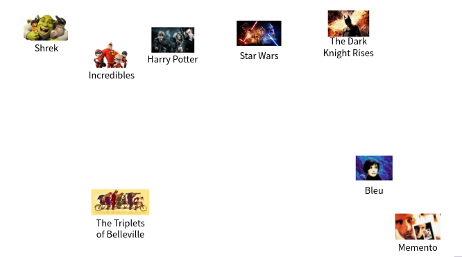
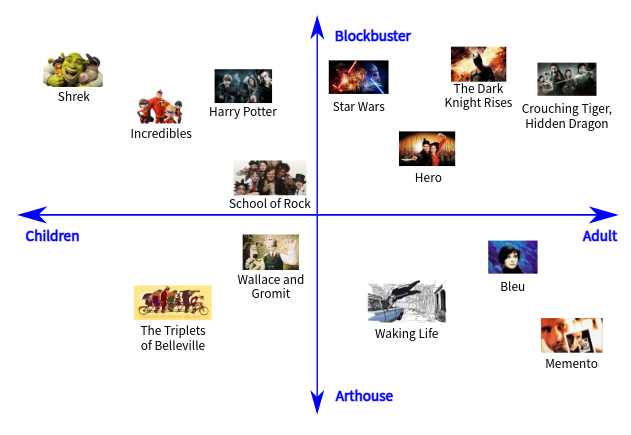

# 嵌入空间(Embedding)的理解

> An **embedding** is a relatively low-dimensional space into which you can translate high-dimensional vectors. Embeddings make it easier to do machine learning on large inputs like sparse vectors representing words. Ideally, an embedding captures some of the semantics of the input by placing semantically similar inputs close together in the embedding space. An embedding can be learned and reused across models.

上面这句话出自谷歌的机器学习速成课。翻译过来就是：嵌套是一种相对低维的空间，你可以将高维矢量映射到这种低维空间里。 通过使用嵌套，可以让在大型输入（比如代表字词的稀疏矢量）上进行机器学习变得更加容易。 在理想情况下，嵌套可以将语义上相似的不同输入映射到嵌套空间里的邻近处，以此来捕获输入的语义。

举一个具体的例子，我们要搭建电影的推荐系统，其本质是对影片进行某种分类：   

上图中，电影按照从左到右的顺序排列，越靠左就越接近动画电影，越靠右就越接近成人电影。这样，我们就完成了简单地推荐系统。如果你看过任何一部儿童影片，那么本系统认为向你推荐左侧的电影是有价值的。

但是上述方法非常简单，不能适应复杂的推荐需求。例如，我想要看偏艺术类的电影，那么上述推荐系统做不到。解决办法比较简单，就是为上面影片的放置多增加一个维度：

在上图中我们不再使用一维而是使用二维平面放置这些影片。其中，靠近左侧的是儿童影片，靠近右侧的是成人影片；越靠近上方越偏向动作类电影，越靠近下放越偏向艺术类电影。这样以来，本推荐系统就具有了更强大的推荐功能。例如，如果你喜欢看儿童艺术类电影，那么本系统会向你推荐左下角的电影。

可能你已经得出了适当的结论：**推荐系统使用了几个维度来分类（或排序）电影，就会有几种推荐的角度**。增加分类电影维度就能增加推荐的精确度。

上图中 ，电影的分类使用了四个维度 。这样，我们就有四个不同的角度推荐电影。在这里我们有一个结论，就是对象有几个关键特征(key feature)，我们就应该使用几个维度对它们进行分类。关键特征可以理解为“角度”，比如推荐电影的角度，是儿童还是成人就是一个关键特征。搭建上述推荐系统，我们认为：

- 我们认为使用d个角度能够良好地描述用户的需求。
- 每部电影被量化为一个d维的向量，其中每一位代表了一个描述电影的角度。

读到这里，你对嵌入（Embedding）已经有基本理解了。如果你在互联网搜索关于Embedding的相关知识，你会看到大量关于自然语言处理中“词嵌入”的内容。

**词嵌入**（Word embedding）是自然语言处理（NLP）中语言模型与表征学习技术的统称。概念上而言，它是指把一个维数为所有词的数量的高维空间[嵌入](https://zh.wikipedia.org/wiki/嵌入_(数学))到一个维数低得多的连续[向量空间](https://zh.wikipedia.org/wiki/向量空间)中，每个单词或词组被映射为[实数](https://zh.wikipedia.org/wiki/实数)[域](https://zh.wikipedia.org/wiki/数域)上的向量。

在数学上，**嵌入**是指一个[数学结构](https://zh.wikipedia.org/wiki/数学结构)经[映射](https://zh.wikipedia.org/wiki/映射)包含到另一个结构中。某个物件*X*称为嵌入到另一个物件*Y*中，是指有一个保持结构的[单射](https://zh.wikipedia.org/wiki/单射)*f*: *X*→*Y*，这个[映射](https://zh.wikipedia.org/wiki/映射)*f*就给出了一个嵌入。上述“保持结构”的准确意思，需由所讨论的结构而定。一个保持结构的映射，在[范畴论](https://zh.wikipedia.org/wiki/範疇論)中称为[态射](https://zh.wikipedia.org/wiki/态射)。

既然是数学概念，就应该能用于各个领域而不仅仅是NLP。事实确实如此，在基于深度学习的CV领域，很多工作（本文于2021年8月撰）中都使用了Embedding。例如，在[Non-local Neural Networks](../unlimited-paper-works/[27]Non-local-Neural-Networks)中，Non-Local就被表示为：
$$
NL_u[i] = \frac{1}{C(i)}\sum_{j\in\Omega}{w(i,j)g(j)}
$$
其中$g(\cdot)$​表示输入的Embedding。当然这只是个例子，由于在深度学习方法中Embedding可以是一个矩阵或者任何类型的转换，是可以通过学习获得的。因此，你可以在任何地方加入一个Embedding。

使用Embedding，使得神经网络在计算中更容易产生聚合良好的特征，或是产生显著的特征。这只是一种理解上的解释。对于其具体的可解释性和证明，需要根据网络结构、目标任务、数据集分布和构造等条件进行说明。

