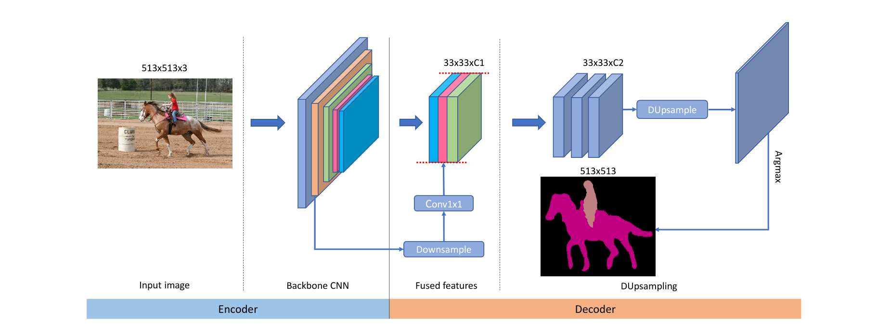

# Decoders Matter for Semantic Segmentation : Data-Dependent Decoding Enables Flexible Feature Aggregation

这是一篇关于数据依赖型解码器的理论和测试工作的论文。

近年来，常见的语义分割方法利用编码器-解码器结构进行逐像素的预测任务。在这些解码器每一层的最后通常是一层双线性上采样的过程，用于将像素恢复至原有像素大小。本论文的研究表明，这种与数据无关的双线性上采样方法可能会导致结果并不完美。

所以，本论文提出了一种依赖于输入数据的上采样取代双线性上采样，称为“DUpsampling”。这个新的方法利用在语义分段标签中的空间冗余，能够从低分辨率的CNN输出中恢复分辨率并实现逐像素预测。该方法在分辨率相对较低的输入上能获得更加精确的分割效果，并且显著降低了计算的复杂度。也就是说：

- 这种新的上采样层重建能力非常强
- 这种方法对任何CNN编码器的组合和使用表现出很好的兼容性

本论文还通过实验标明了，DUpsampling性能优越，并且无需任何后处理。

> Recent semantic segmentation methods exploit encoder-decoder architectures to produce the desired pixel-wise segmentation prediction. The last layer of the decoders is typically a bilinear upsampling procedure to recover the final pixel-wise prediction. We empirically show that this oversimple and data-independent bilinear upsampling may lead to sub-optimal results. 
> In this work, we propose a data-dependent upsampling (DUpsampling) to replace bilinear, which takes advantages of the redundancy in the label space of semantic segmentation and is able to recover the pixel-wise prediction from low-resolution outputs of CNNs. The main advantage of the new upsampling layer lies in that with a relatively lower-resolution feature map such as 1/16 or 1/32 of the input size, we can achieve even better segmentation accuracy, significantly reducing computation complexity. This is made possible by 1) the new upsampling layer's much improved reconstruction capability; and more importantly 2) the DUpsampling based decoder's flexibility in leveraging almost arbitrary combinations of the CNN encoders' features. Experiments demonstrate that our proposed decoder outperforms the state-of-the-art decoder, with only 20% of computation. Finally, without any post-processing, the framework equipped with our proposed decoder achieves new state-of-the-art performance on two datasets: 88.1% mIOU on PASCAL VOC with 30% computation of the previously best model; and 52.5% mIOU on PASCAL Context.     

如果有时间的话请阅读[原作](/papers/Decoders-Matter-for-Semantic-Segmentation-Data-Dependent-Decoding-Enables-Flexible-Feature-Aggregation.pdf)。本文只是对原作阅读的粗浅笔记。

---

现阶段，基于FCN的稠密预测方法在语义分割领域内取得了巨大的成功，事实证明，CNN组成的编码器的特征提取功能非常强大。很重要的一点是，卷积运算所具有的参数共享特性让训练和预测变得高效（卷积运算的一些特性可以参考[这篇文章](../ch2p1/<1>convolutional-nn-and-ops.md)）。

在原始的FCN方法中，编码器在提取高级特征的过程中往往会导致原图的分辨率被降低很多倍，从而导致精细的像素空间信息部分丢失，这使在原图分辨率上的预测（尤其是在对象边界上的预测）往往不够准确。DeepLab中引入了空洞卷积（空洞卷积的大致概念可以参考[这篇文章](./<1>The-Devil-is-in-the-Decoder-Classification-Regression-and-GANs.md)中关于空洞卷积方法的部分）实现了在不降低原图大小的情况下扩大感受野（接收场）的效果。

上图是一个在DeepLabv3+中使用的典型的Encoder-Decoder（编码器-解码器）结构。这个结构的编码器对输入进行了下采样比例为4的下采样后输入到解码器，并在最终的多特征图合并前对编码器产生的高阶特征进行了上采样，最后，使用双线性插值上采样完全恢复分辨率。在这个过程中，编码器是由CNN表示的，其任务是在原图上提取出不同级别的特征；解码器是由很多上采样表示的，其任务是将编码器产生的特征恢复到原图大小。

在以前的成果中，编码器通常由一些编码器和双线性上采样层构成。

