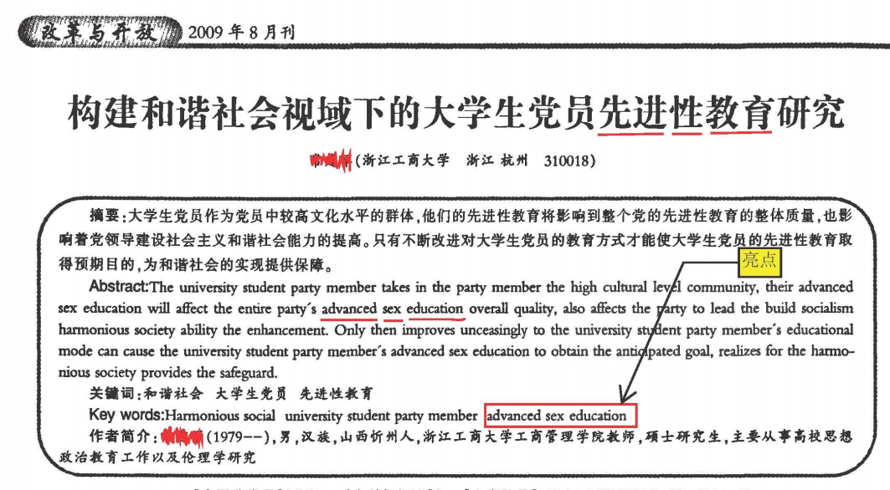

# 欢迎来到魔法部日志

如果你看到了这里，说明你已经准备好开始探求这个领域事物的规律以及这些规律的本源了。作为一个本科生，最适合你入坑的就是开始习惯性阅读领域内论文。大约在我的大二的下半学期，我和我的朋友们开始共同阅读论文并写下笔记。这些笔记粗浅、幼稚，甚至会出现一些理解上的错误——万事开头难。但是我们还是想把这些笔记整理起来——这便是魔法部日志的开始。在我新建文件夹的时候，魔法部日志的文件夹名称是“unlimited paper works”，在成为理性的怀疑者之前，应该先掌握这个科研领域。我们做好了长期投入的准备，并希望把简单的事情做到出人意料得精彩。

加入魔法部日志也不是什么难事，你只需要热身一下，读完下面的一篇引导，就可以开始了(以下内容已通过语法检查工具[PaperCube](https://github.com/PaperCube)的检查)。

## How to Read and Comprehend Scientific Research Articles

Scientific articles are how scholars and researchers communicate with each other. Reading scientific articles helps you to participate in your comprehension by wondering how the researchers explain their ideas. Books, websites, papers, scientific magazines are general places to start with.

This tutorial will discuss:

- How to read a scientific article
- How to find the main points of an article
- How to take effective notes

### How to read a scientific article

The least effective way to read scientific articles is from the start to finish. Instead, expert researchers scan the article skimming for key findings. The structured scientific articles are defined by several distinct sections. Most articles like lab reports are divided into five sections:

- Abstract
- Introduction
- Methods 
- Results
- Discussion

And the most effective way to read a scientific article is to follow this order: Abstract, Discussion, Introduction, Results, Methods. The difference between the original structure and suggested reading order are listed below:

| The original structure | Order suggested |
| ---------------------- | --------------- |
| Abstract               | Abstract        |
| Introduction           | Discussion      |
| Methods                | Introduction    |
| Results                | Results         |
| Discussion             | Methods         |

By reading in the suggested order, you can quickly find the information you need to determine if the article is useful for you. After you read each section, asking yourself whether the article is interesting and relevant enough to your research assignment will help you to decide whether to continue reading it.

#### The Abstract

Abstract usually contains four kinds of information:

- Purpose of the study (why they did it)
- Methodology (how they did it)
- Results (what they have found)
- Conclusion (what it means)

After reading these sections, think about whether you should continue your reading.

#### The Discussion

This section usually contains things below:

- Clear answers about the question posed in the introduction
- Explanations about how the results supports the conclusions

After reading this sections ask yourself whether you understand and believe the author(s)' claims.

#### The Introduction

The introduction serves two purposes:

- Stimulating and interests the subject
- Putting the article in the large context

Generally introductions achieve these goals by leading the reader from the `General`(what is already known to the topic), to the `Specific`(what is not yet known), to the `Focused Question`(what the authors are asking). Thus, the authors describe previous works and how they are related to it.

Before we move on to the next section, ask yourself why the authors did this study, and, does the researched question match up with the conclusions in the discussion?

#### The results

The results' section states:

- What the author has found
- Key data, often shown in figures or tables

Ask yourself if the data collected are appropriate to answer the researched question before moving on to the next section.

#### The methods

The method sections tells the reader:

- What experiments were done to answer the question stated in the introduction

This section can be difficult to read for students due to the technical language used and complex details listed. However, you can fully understand what happened by reading it carefully.

### How to find the main points of an article

While you are reading the article, also distinguish the author's main points. It can be difficult to distinguish between the main point and less relevant sub-points.

Key places to look for the main points include:

- The article title
- The abstract
- Keywords
- Figure and Table titles
- The first and the last sentences of the Introduction

The keywords to look out for the main points include:

- "We hypothesize that..."
- "We propose..."
- "We introduce..."

### How to take effective notes

Another important part of reading and comprehending a scientific article is to take notes. Effective note-taking will save your time and help you clarify your thoughts.

Creating a standard template for taking note will help you organize your research and enable you to make quick comparisons and will save your time re-reading articles. 

A possible template of reading articles can be:

| Article title        |      |
| -------------------- | ---- |
| Author(s)            |      |
| Journal              |      |
| Date                 |      |
| Pages/Volume         |      |
| Issues               |      |
| URL                  |      |
| Main concepts        |      |
| My critical response |      |

### Summary

So we know that reading a paper in the proper order, making full understand of the author's main points, and taking effective notes can be a effective way to do your research.

好了，你可以启程了。

---

## 写作一篇科技类论文？

注：这一部分是在听了陈关荣教授的分享后写下的。

### 认真写作的重要性

请认真写作。

上图是不认真写作的结果。

### 一篇科技论文典型的结构

| Content                 | 描述                                                         |
| ----------------------- | ------------------------------------------------------------ |
| Title（题目）           | 文献的题目。通常情况下，文献的题目应该简单、准确、精炼、引人注目，表达文章主要内容或思想。 |
| Author（作者）          | 文献的作者。（千万不能未经同意和许可就随便地把别人例如导师的名字加到文章上单方面去投稿） |
| Abstract（摘要）        | 文献的摘要，要全面准确、简明握要。摘要是供出版社、图书馆、信息库检索用的，通常要单独刊登，因此，要自我完备，尽量不要使用数学公式、数学符号、方程序号、 引文序号、图表等等。 |
| Keywords（关键词）      | 文章的关键字，文章所包含的研究领域或方向，并且应该用单数（例如：“attractor” 而不是 “attractors”）。SCI 系统利用关键词来分类文献，并且读者利用关键词来搜索文章。 关键词不全面可能导致检索遗漏和引用减少。 |
| Introduction（引言）    | 引言应该全面、客观、准确地介绍问题的背景和历史发展， 他人以及自己的贡献，本文的动因和主要成果。注意，短文在引言部分并不一定需要说明文章的基本结构。 |
| Sections（段落）        | 文章的内容分为很多段落。这些段落的标题、编号和格式应该尽量统一；在写作时，要尽量避免冗长的句子、避免不必要的符号和定义、避免太多太滥的缩写、避免太多太滥的方程号码。 |
| Conclusion（结论）      | 文章的结论。结论中不要简单地改写甚至重复文章的摘要；和摘要部分一样，结论部分不要援引前文中出现过的方程号码、图表号码， 不要重新讨论数学公式、给出定理补充证明之类。 |
| Acknowledgement（致谢） | 在这部分可以感谢认真而又有实质性建议的匿名审稿人、认真而又有实质性建议的朋友、以及有关科研基金。 |
| References（参考文献）  | 这部分列表呈现写作时参考的文献。请注意严格使用标准格式。关于格式，请使用统一格式，或使用你打算投稿的那个杂志的格式。文献的多少要恰当：不要漏掉重要和必要的文献，又不要罗列多余且毫不相关的文章。 |
| Appendix（附录）        | 附录通常可以放一些比较长的引理和定理的证明，方便读者在阅读简洁的原文后查阅。 |

你可以通过一些工具来规范你的写作。

---

## Q&A

1. Q：为什么每篇笔记后面首先会跟一个笔记作者的信息的三级标题？

   A：为了建立静态索引。这样你在搜索框里就能直接通过搜索笔记作者的名称来找到他/她写下的全部笔记。

2. Q：为什么笔记的格式不统一？

   A：因为本部分是又很多人一起写下的笔记。大家写笔记的风格都不一样。

   Q：那怎样读到适合自己的笔记格式？

   A：如果你更倾向于阅读某位笔记作者的笔记，可以在网页右上方的搜索框搜索其名称。

3. Q：这些笔记的排列有什么顺序吗？

   A：有，时间顺序。越新的笔记越靠下。将来unlimited-paper-works将会从ml.akasaki.space迁移出去，到时候会使用更合理的排列顺序。

4. Q：读了这些笔记就一定懂了这些论文吗？

   A：并不。有机会请阅读原论文。这些笔记并不保证完善，甚至可能出现错误。
