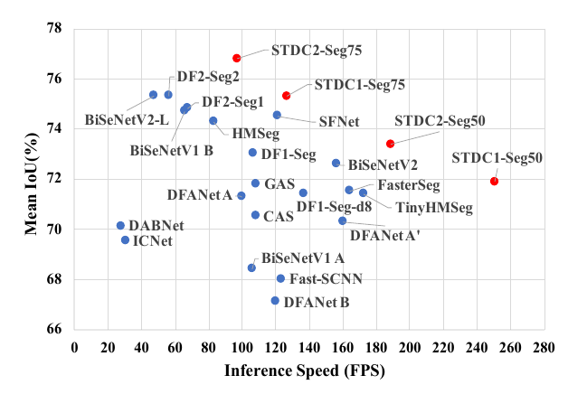
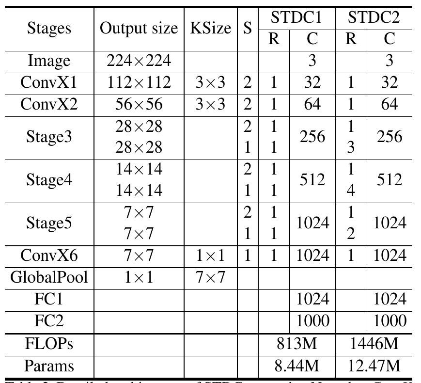
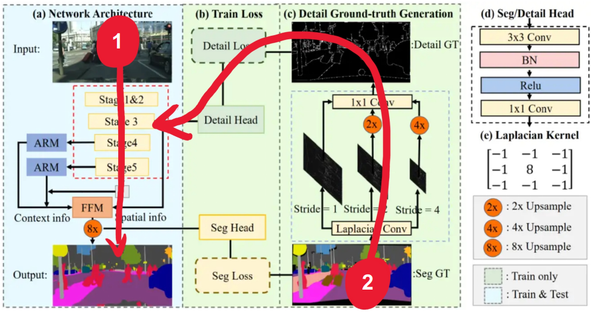
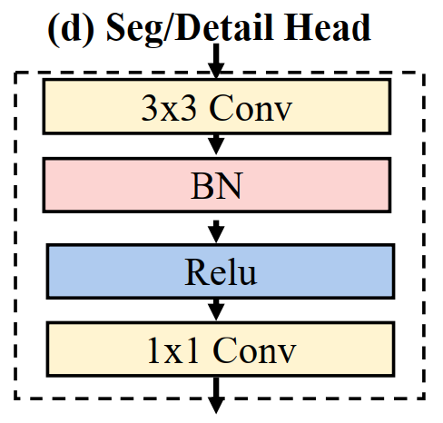
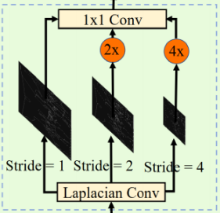

# Rethinking BiSeNet For Real-time Semantic Segmentation

[Mingyuan Fan](https://arxiv.org/search/cs?searchtype=author&query=Fan%2C+M), [Shenqi Lai](https://arxiv.org/search/cs?searchtype=author&query=Lai%2C+S), [Junshi Huang](https://arxiv.org/search/cs?searchtype=author&query=Huang%2C+J), [Xiaoming Wei](https://arxiv.org/search/cs?searchtype=author&query=Wei%2C+X), [Zhenhua Chai](https://arxiv.org/search/cs?searchtype=author&query=Chai%2C+Z), [Junfeng Luo](https://arxiv.org/search/cs?searchtype=author&query=Luo%2C+J), [Xiaolin Wei](https://arxiv.org/search/cs?searchtype=author&query=Wei%2C+X)

### 这篇笔记的写作者是[VisualDust](https://github.com/visualDust)。

> BiSeNet has been proved to be a popular two-stream network for real-time segmentation. However, its principle of adding an extra path to encode spatial information is time-consuming, and the backbones borrowed from pretrained tasks, e.g., image classification, may be inefficient for image segmentation due to the deficiency of task-specific design. To handle these problems, we propose a novel and efficient structure named Short-Term Dense Concatenate network (STDC network) by removing structure redundancy. Specifically, we gradually reduce the dimension of feature maps and use the aggregation of them for image representation, which forms the basic module of STDC network. In the decoder, we propose a Detail Aggregation module by integrating the learning of spatial information into low-level layers in single-stream manner. Finally, the low-level features and deep features are fused to predict the final segmentation results. Extensive experiments on Cityscapes and CamVid dataset demonstrate the effectiveness of our method by achieving promising trade-off between segmentation accuracy and inference speed. On Cityscapes, we achieve 71.9% mIoU on the test set with a speed of 250.4 FPS on NVIDIA GTX 1080Ti, which is 45.2% faster than the latest methods, and achieve 76.8% mIoU with 97.0 FPS while inferring on higher resolution images.

在阅读本文前，请先阅读[BiSeNet: Bilateral Segmentation Network for Real-time Semantic Segmentation](./[24]BiSeNet-Bilateral-Segmentation-Network-for-Real-time-Semantic-Segmentation)。

该论文提出[BiSeNet](./[24]BiSeNet-Bilateral-Segmentation-Network-for-Real-time-Semantic-Segmentation)被证明是不错的双路实时分割网络。不过，在BiSeNet中：

- 单独为空间信息开辟一条网络路径在计算上非常的耗时
- 用于spatial path的预训练轻量级骨干网络从其他任务中（例如分类和目标检测）直接拿来，用在分割上效率不很高。

因此，作者提出Short-Term Dense Concatenate network（**STDC** network）来代替BiSeNet中的context path。其核心内容是移除冗余的结构，进一步加速分割。具体来说，本文将特征图的维数逐渐降低，并将特征图聚合起来进行图像表征，形成了STDC网络的基本模块。同时，在decoder中提出Detail Aggregation module将空间信息的学习以single-stream方式集成到low-level layers中，用于代替BiSeNet中的spatial path。最后，将low-level features和deep features融合以预测最终的分割结果。

注：上图中红色虚线框中的部分是新提出的STDC network；ARM表示注意力优化模块（Attention Refinement Module），FFM表示特征融合模块（Feature Fusion Module）。这两个模块是在[BiSeNet: Bilateral Segmentation Network for Real-time Semantic Segmentation](./[24]BiSeNet-Bilateral-Segmentation-Network-for-Real-time-Semantic-Segmentation)就已经存在的设计。

有兴趣请阅读原论文[Rethinking BiSeNet For Real-time Semantic Segmentation](https://arxiv.org/abs/2104.13188)。

---

## Related Works

### Efficient Network Designs

模型设计在计算机视觉任务中起着重要作用。 SqueezeNet使用Fire Module和某些策略来减少模型参数；MobileNet V1利用深度可分离卷积来减少推理阶段的 FLOP。 ResNet采用残差构建层来实现出色的性能； MobileNet V2 和 ShuffleNet 使用Group Convolution 来降低计算成本，同时保持可比的准确性。不过上述网络是针对图像分类任务设计的。对于实时分割任务，**需要新的网络结构设计或优化**。

### Generic Semantic Segmentation

传统的分割算法，例如阈值选择、超分辨，利用手工制作的特征来分配图像中的像素级标签。 随着卷积神经网络的发展，基于全卷积网络的方法在各种基准测试中取得了令人印象深刻的性能。 Deeplabv3采用了一个多尺度空间的的空间金字塔池化模块来捕获多尺度上下文。 SegNet利用编码器-解码器结构来恢复高分辨率特征图。PSPNet设计了金字塔池化来捕获膨胀主干上的局部和全局上下文信息。 使用空洞卷积的主干网络和编码器-解码器结构都可以同时学习低级细节和高级语义。 然而，由于高分辨率特征和复杂的网络连接，大多数方法需要大量的计算成本。 在本文中，作者提出了一种高效且有效的架构，可以在速度和准确性之间取得良好的平衡。

### Real-time Semantic Segmentation

最近，实时语义分割的实际应用正在快速增长。在这种情况下，有两种主流可以设计有效的分割方法：

1. 轻量级主干。 DFANet 采用轻量级主干来降低计算成本，并设计了一个跨级特征聚合模块来提高性能。 DFNet [21] 利用“偏序剪枝”算法获得轻量级主干和高效解码器。
2. 多分支架构。 ICNet [31] 设计了多尺度图像级联以实现良好的速度-精度权衡。 BiSeNetV1 [28] 和 BiSeNetV2 [27] 分别为低级细节和高级上下文信息提出了双流路径。

在本文中，我们提出了一种高效的轻量级主干来提供可扩展的感受野。 此外，我们设置了一个单路径解码器，它使用详细信息指导来学习低级细节。

## Short-Term Dense Concatenate network（STDC network）

BiSeNet V1 利用轻量级主干，例如 ResNet18 和spatial path作为编码网络，形成双流分割架构。

作者提到，额外使用一个网络分支对low level的feature进行编码在设计上有冗余，使整个编码网络效率低下。所以，作者取消了Spatial path，使用一个Detail Guidance指导主干网络进行学习。而这个被指导的主干网络就是STDC Network。

上图中(a)为这篇论文中Encoder的设计，(b)是BiSeNet中context path的设计。(a)中红色标注部分是STDC  Network的设计，其功能是代替(b)称为主干网络。

下图是STDC Network的基本构成：

上图中，(a)为STDC网络，可以看到它由很多个Stage组成，每个Stage又包含若干STDC Module；(b)为STDC Module；(c)为stride = 2的STDC Module。其中，$M$表示输入的维度，$N$​​​表示输出的维度。ConvX表示Conv-BN-ReLU的连续结构，每个网络的块是由不同kernal size的ConvX。

对于STDC网络，Stage1~Stage5进行下采样和编码；Stage6用于分类。

对于每个Stage，Stage1和Stage2使用单纯的卷积进行编码，而Stage3~Stage5使用STDC Module进行编码。

对于每个STDC模块（STDC Module），其输入通道数为$M$，其输出通道数为$N$，其由若干个Block组成，第$i$​个Block的输出可以表示成：
$$
x_i = ConvX_i(x_{i-1},k_i)
$$
其中$X_{i-1}$表示$x_i$表示第$i$个块的输出，$x_{i-1}$表示第$i$个块的输入（也就是第$i-1$个块的输出），$k_i$​表示卷积层的kernal size。

STDC模块中，第一个block的kernel size为1，其余简单设置为3。可以注意到，在网络的每个阶段，特征图的channel数量以$\frac{N}{2}$、$\frac{N}{4}$、$\frac{N}{8}$逐渐下降。作者认为在图像分类任务中，随着网络层数的增加逐渐增加特征图的通道数是一种常见做法。但是在语义分割任务中，在较浅的网络层，往往需要足够多的通道数保证感知的细粒度；而在感受野较大的深层网络中，应该更加注重高层级信息的归纳，一直增加通道的数量会导致信息的冗余。我们专注于可扩展的感受野和多尺度信息。

为了将低层级的细粒度特征转递至网络末端STDC中仅有Block2中进行了下采样（stride=2）；并且STDC中存在多条skip-path。在图中最后的Fusion中，各个阶段的特征会通过concatenation进行特征拼接：
$$
X_{output} = F(x_1,x_2,.....,x_n)
$$
其中$F$是任何可以进行特征融合的方法。在拼接之前，会通过$3\times 3$平均池化下采样到相同的空间大小。

| STDC module | Block1      | Block2      | Block3      | Block4        | Fusion                                             |
| ----------- | ----------- | ----------- | ----------- | ------------- | -------------------------------------------------- |
| RF(S = 1)   | $1\times 1$ | $3\times 3$ | $5\times 5$ | $7\times 7$   | $1\times 1$、$3\times 3$、$5\times 5$、$7\times 7$ |
| RF(S = 2)   | $1\times 1$ | $3\times 3$ | $7\times 7$ | $11\times 11$ | $3\times 3$、$7\times 7$、$11\times 11$            |

上表为STDC中各个阶段的感受野大小。$X_{output}$是多尺度融合的特征。

这种STDC的设计有如下的优点：

1. 随着网络层数加深，卷积核的shape呈几何级数下降，计算复杂度显著性降低。
2. 最终的输出中融合了来自不同阶段Block的特征，集成了来自可变大小的特征图。

如果给定了输入大小$M$和输出大小$N$，可以算出STDC的参数量是：
$$
S_{param} = M\times 1\times 1 \times \frac{N}{2^1} + \sum_{i=2}^{n-1}\frac{N}{2^{i-1}}\times 3 \times 3 \times \frac{N}{2^i}+\frac{N}{2^{n-1}}\\
=\frac{NM}{2}+\frac{9N^2}{2^3}\times \sum_{i=0}^{n-3}\frac{1}{2^{2i}}+\frac{9N^2}{2^{2n-2}}\\
=\frac{NM}{2}+\frac{3N^2}{2}\times (1+\frac{1}{2^{2n-3}})
$$
对于给定的$M$和$N$​，STDC的参数量几乎不受其他因素的影响。

上表是STDC每个Stage设计的细节。

## Detail Ground-truth Generation

在这篇论文中，作者认为BiSeNet中的Spatial path产生了大量的冗余计算，因此作者设计Detail Ground-truth Generation，将其作为网络学习的指导（Detail Guidance），替代Spatial path的作用。这样以来，Spatial path被移除，节约了大量的计算量。

作者将参与训练的整个网络结构分为三部分：

- 分割网络（Network Architecture，图中蓝色背景的(a)部分）
- Loss计算部分（Train Loss，图中绿色背景(b)的部分）
- 细节特征拾取部分（Detail Ground-truth Generation，图中绿色背景(c)部分）

在整个网络结构图中，可以看到部分网络结构（绿色背景）是Train-only的。也就是这些结构只在训练中出现，而在预测过程中不会出现。其中Detail Ground-truth Generation就是Train-only的。

上图是对网络传播过程的直观理解，可以看出，Detail Ground-truth Generation是为encoder（STDC特征提取网络）服务的。其中，输入1表示原图，输入2表示分割的Ground-truth。

Detail Ground-truth Generation的设计目的是为了使用已知的图像细节（ground truth）来引导STDC网络学习过程，以使其具有与添加spatial path一样的良好效果。其具体步骤是：

1. 读取数据集的Ground-truth，在Ground-truth上使用拉普拉斯算子进行卷积，产生Detail Map。
2. 在STDC网络的Stage3插入一个称为Detail Head的模块，Detail Map通过该模块汇入STDC网络。

其中在二步的Detail Head模块设计如下图所示：

Detail Head是一个Conv-BN-ReLU形的结构，后面接续一个$1\times 1$卷积。在实验中，作者证明了Detail Head的设计能够有效增强特征。

第一步用于产生Detail Map的算子是一个称为**拉普拉斯（Laplacian）算子**的特征提取器：
$$
\begin{matrix}
-1 & -1 & -1 \\
-1 & 8 & -1 \\
-1 & -1 & -1
\end{matrix} \tag{1}
$$
拉普拉斯（Laplace）算子作为边缘检测之一，和Sobel算子一样也是工程数学中常用的一种积分变换。拉普拉斯算子用在图像上就属于空间锐化滤波操作。

在这篇论文中，作者通过三个不同步幅的拉普拉斯算子卷积得到多尺度的detail，在再将它们上采样到原来的大小，再通过$1\times 1$卷积将它们融合（这里原文是dynamic re-wegihting）形成最终的Detail GT：

拉普拉斯算子和其他的一些边缘检测算子具有区别。Prewitt和Sobel两个出名的算子都是通过求一阶导数来计算梯度的，通常用于边缘线的检测。对于细节特征，除了检测线，有时候也需要检测特殊点，著名的就是拉普拉斯（Laplacian）算子。拉普拉斯算子在边缘检测的应用中并不局限于水平方向或垂直方向，这是Laplacian与soble的区别。

上图为图像边缘的信号经过一阶和二阶求导后信号变化的直观表示。对图像求两次导数，公式如下：
$$
\begin{aligned}
&\nabla^2f(x,y) = \frac{\partial^2 f}{\partial x^2}+\frac{\partial^2 f}{\partial y^2}\\
&=\{f(x+1,y)+f(x-1,y)-2f(x,y)\} + \{f(x,y+1)+f(x,y-1)-2f(x,y)\}\\
&=f(x+1,y)+f(x-1,y)+f(x,y+1)+f(x,y-1)-4f(x,y)
\end{aligned}
$$
下图是作者对网络各个阶段的特征的可视化。可以看出，通过这种设计，被移除Spatial path后，前置特征提取网络依然能较好地关注空间细节。 

## Detail Loss

由于在一幅图片中，代表细节的像素数量比较少。具体来说，对于画面中的实体，边缘的像素总比内部的像素少。所以，detail-prediction是一个类别不均衡的问题，具有权重的交叉熵（cross-entropy）总是会导致粗略的学习结果。因此，参考Learning to predict crisp boundaries（ECCV的一篇文章），这里作者使用了二元交叉熵（binary cross-entropy）+ 骰子损失（dice loss）来对学习进行优化。

骰子损失能够衡量prediction和ground-truth之间的交叠水平，并且它对前景/背景的像素不敏感——这意味着它可以缓解类不平衡问题。 因此对于高度为 $H$ 宽度为 $W$ 的预测细节图（predicted detail map），细节损失$L_{detail}$ 的公式如下：
$$
L_{detail}(p_d,g_d) = L_{dice}(p_d,g_d)+L_{bce}(p_d,g_d)
$$
上式中$p_d\in\R^{H\times W}$代表预测的细节图（predicted detail map），$g_d\in\R^{H\times W}$表示相应的Ground-truth。$L_{bce}$表示二元交叉熵损失公式，$L_{dice}$表示骰子损失的公式。其中骰子损失的公式如下：
$$
L_{dice}(p_d,g_d) = 1-\frac{2\sum_i^{H\times W}p_d^ig_d^i + \epsilon}{\sum_i^{H\times W}(p_d^i)^2+\sum_i^{H\times W}(g_d^i)^2 + \epsilon}
$$
上式中 $i$ 表示第$i$个像素，$\epsilon$表示拉普拉斯平滑项（为了避免除数是0）.在这篇论文中$\epsilon = 1$。
