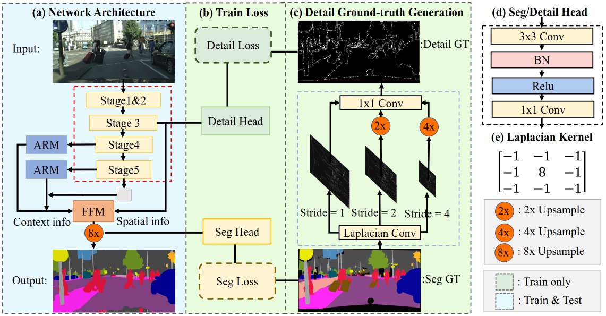

# Rethinking BiSeNet For Real-time Semantic Segmentation

[Mingyuan Fan](https://arxiv.org/search/cs?searchtype=author&query=Fan%2C+M), [Shenqi Lai](https://arxiv.org/search/cs?searchtype=author&query=Lai%2C+S), [Junshi Huang](https://arxiv.org/search/cs?searchtype=author&query=Huang%2C+J), [Xiaoming Wei](https://arxiv.org/search/cs?searchtype=author&query=Wei%2C+X), [Zhenhua Chai](https://arxiv.org/search/cs?searchtype=author&query=Chai%2C+Z), [Junfeng Luo](https://arxiv.org/search/cs?searchtype=author&query=Luo%2C+J), [Xiaolin Wei](https://arxiv.org/search/cs?searchtype=author&query=Wei%2C+X)

> BiSeNet has been proved to be a popular two-stream network for real-time segmentation. However, its principle of adding an extra path to encode spatial information is time-consuming, and the backbones borrowed from pretrained tasks, e.g., image classification, may be inefficient for image segmentation due to the deficiency of task-specific design. To handle these problems, we propose a novel and efficient structure named Short-Term Dense Concatenate network (STDC network) by removing structure redundancy. Specifically, we gradually reduce the dimension of feature maps and use the aggregation of them for image representation, which forms the basic module of STDC network. In the decoder, we propose a Detail Aggregation module by integrating the learning of spatial information into low-level layers in single-stream manner. Finally, the low-level features and deep features are fused to predict the final segmentation results. Extensive experiments on Cityscapes and CamVid dataset demonstrate the effectiveness of our method by achieving promising trade-off between segmentation accuracy and inference speed. On Cityscapes, we achieve 71.9% mIoU on the test set with a speed of 250.4 FPS on NVIDIA GTX 1080Ti, which is 45.2% faster than the latest methods, and achieve 76.8% mIoU with 97.0 FPS while inferring on higher resolution images.

在阅读本文前，请先阅读[BiSeNet: Bilateral Segmentation Network for Real-time Semantic Segmentation](./[24]BiSeNet-Bilateral-Segmentation-Network-for-Real-time-Semantic-Segmentation.md)。

该论文提出[BiSeNet](./[24]BiSeNet-Bilateral-Segmentation-Network-for-Real-time-Semantic-Segmentation.md)被证明是不错的双路实时分割网络。不过单独为空间信息开辟一条网络路径在计算上非常的耗时，并且用于spatial path的预训练轻量级骨干网络从其他任务中（例如分类和目标检测）直接拿来，用在分割上效率不很高。因此,作者提出Short-Term Dense Concatenate network（STDC network），其核心内容是移除冗余的结构，进一步加速分割。有兴趣请阅读原论文[Rethinking BiSeNet For Real-time Semantic Segmentation](https://arxiv.org/abs/2104.13188)。

---

