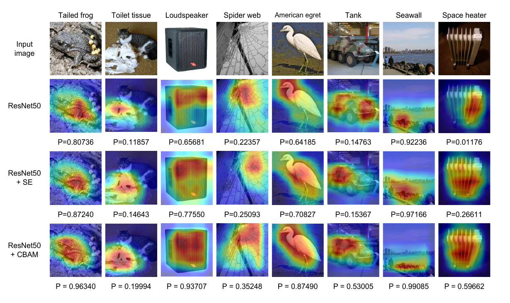

# CBAM: Convolutional Block Attention Module



[Sanghyun Woo](https://arxiv.org/search/cs?searchtype=author&query=Woo%2C+S), [Jongchan Park](https://arxiv.org/search/cs?searchtype=author&query=Park%2C+J), [Joon-Young Lee](https://arxiv.org/search/cs?searchtype=author&query=Lee%2C+J), [In So Kweon](https://arxiv.org/search/cs?searchtype=author&query=Kweon%2C+I+S)

> We propose Convolutional Block Attention Module (CBAM), a simple yet effective attention module for feed-forward convolutional neural networks. Given an intermediate feature map, our module sequentially infers attention maps along two separate dimensions, channel and spatial, then the attention maps are multiplied to the input feature map for adaptive feature refinement. Because CBAM is a lightweight and general module, it can be integrated into any CNN architectures seamlessly with negligible overheads and is end-to-end trainable along with base CNNs. We validate our CBAM through extensive experiments on ImageNet-1K, MS~COCO detection, and VOC~2007 detection datasets. Our experiments show consistent improvements in classification and detection performances with various models, demonstrating the wide applicability of CBAM. The code and models will be publicly available.

CBAM是一篇结合了通道注意力和空间注意力的论文。它通过在同个模块中叠加通道注意力和空间注意力达到了良好的效果。为了提升 CNN 模型的表现，除了对网络的深度、宽度下手，还有一个方向是注意力。注意力不仅要告诉我们重点关注哪里，提高关注点的表达。 我们的目标是通过使用注意机制来增加表现力，关注重要特征并抑制不必要的特征。

为了强调空间和通道这两个维度上的有意义特征，作者依次应用通道和空间注意模块，来分别优化卷积神经网络在通道和空间维度上学习能力。作者将注意力过程分为通道和空间两个独立的部分，这样做不仅可以节约参数和计算力，而且保证了其可以作为即插即用的模块集成到现有的网络架构中去。

---

## Channel Attention Module（通道注意力）

关于通道注意力的相关设计细节请参考[Squeeze-and-Excitation Networks (SENet)](./[23]Squeeze-and-Excitation-Networks.md)。在这里不进行非常详细的设计。特征的每一个通道都代表着一个专门的检测器，因此，通道注意力是关注什么样的特征是有意义的。为了汇总空间特征，作者采用了全局平均池化和最大池化两种方式来分别利用不同的信息。


在这篇论文中，作者使用Global Average Pool和Max Pool共用构造Channel wise的注意力。如上图所示，输入是一个 $H\times W\times C$的特征 $F$，我们先分别进行一个空间的全局平均池化和最大池化得到两个$1\times 1\times C$的通道描述。接着，再将它们分别送入一个两层的神经网络，第一层神经元个数为$C/r$，激活函数为 $ReLU$，第二层神经元个数为。注意，它们使用共享的参数建立通道相关性。将得到的通道描述乘以输入特征$F$即可得到加入了通道相关性的特征。

相较于原本的[SENet](./[23]Squeeze-and-Excitation-Networks.md)，本文同时使用Global Average Pooling和Max Pooling。在后续的实验结果中可以看到，在通道注意力模块中，同时引入最大池化和平均池化可以得到最好的效果。

## Spatial Attention Module（空间注意力）


与通道注意力相似，给定一个 $H\times W\times C$ 的特征 $F$，先分别进行一个通道维度的平均池化和最大池化得到两个 $H\times W\times 1$ 的通道描述，并将这两个描述按照通道拼接在一起。经过一个 $7\times 7$ 的卷积层，激活函数为 $Sigmoid$，得到权重系数 $M_s$。将权重系数和特征 $F$ 相乘即可得到加入了空间注意力的特征图。

在空间注意力模块中，同时引入最大池化和平均池化比利用一个 $1\times 1$ 的卷积要好，同时，卷积层采用 $7\times 7$ 的卷积核要优于 $3\times 3$ 的卷积核。

## Convolutional Block Attention Module

通道注意力和空间注意力这两个模块可以以并行或者顺序的方式组合在一起，但是作者发现顺序组合并且将通道注意力放在前面可以取得更好的效果。


一个完整的 CBAM 模块如上图所示，其 TensorFlow 的一个实现如下所示：

```python
def CBAM(input, reduction):
    """
    @Convolutional Block Attention Module
    """

    _, width, height, channel = input.get_shape()  # (B, W, H, C)

    # channel attention
    x_mean = tf.reduce_mean(input, axis=(1, 2), keepdims=True)   # (B, 1, 1, C)
    x_mean = tf.layers.conv2d(x_mean, channel // reduction, 1, activation=tf.nn.relu, name='CA1')  # (B, 1, 1, C // r)
    x_mean = tf.layers.conv2d(x_mean, channel, 1, name='CA2')   # (B, 1, 1, C)

    x_max = tf.reduce_max(input, axis=(1, 2), keepdims=True)  # (B, 1, 1, C)
    x_max = tf.layers.conv2d(x_max, channel // reduction, 1, activation=tf.nn.relu, name='CA1', reuse=True)
    # (B, 1, 1, C // r)
    x_max = tf.layers.conv2d(x_max, channel, 1, name='CA2', reuse=True)  # (B, 1, 1, C)

    x = tf.add(x_mean, x_max)   # (B, 1, 1, C)
    x = tf.nn.sigmoid(x)        # (B, 1, 1, C)
    x = tf.multiply(input, x)   # (B, W, H, C)

    # spatial attention
    y_mean = tf.reduce_mean(x, axis=3, keepdims=True)  # (B, W, H, 1)
    y_max = tf.reduce_max(x, axis=3, keepdims=True)  # (B, W, H, 1)
    y = tf.concat([y_mean, y_max], axis=-1)     # (B, W, H, 2)
    y = tf.layers.conv2d(y, 1, 7, padding='same', activation=tf.nn.sigmoid)    # (B, W, H, 1)
    y = tf.multiply(x, y)  # (B, W, H, C)

    return y
```

## Example

使用该模块的例子，如将其集成于ResNet中：


