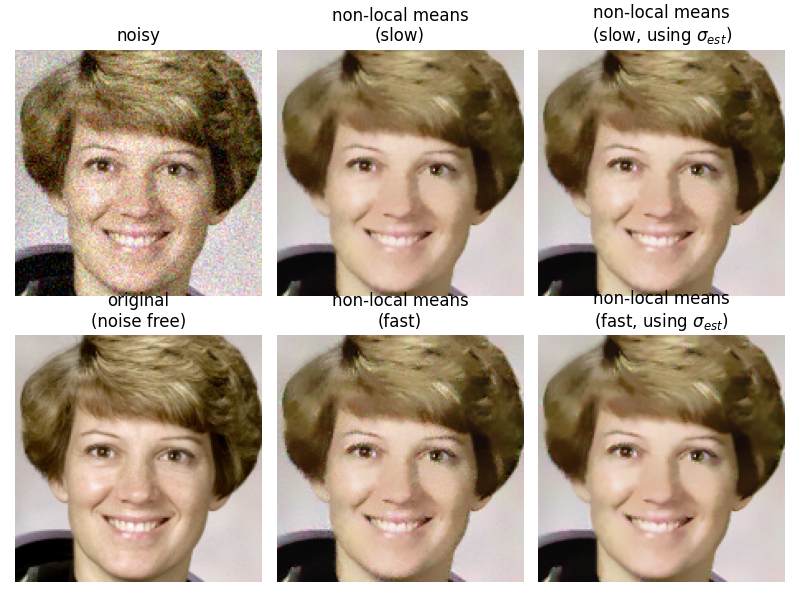
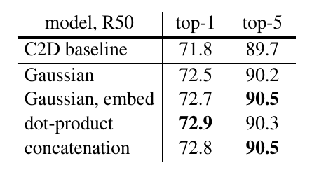
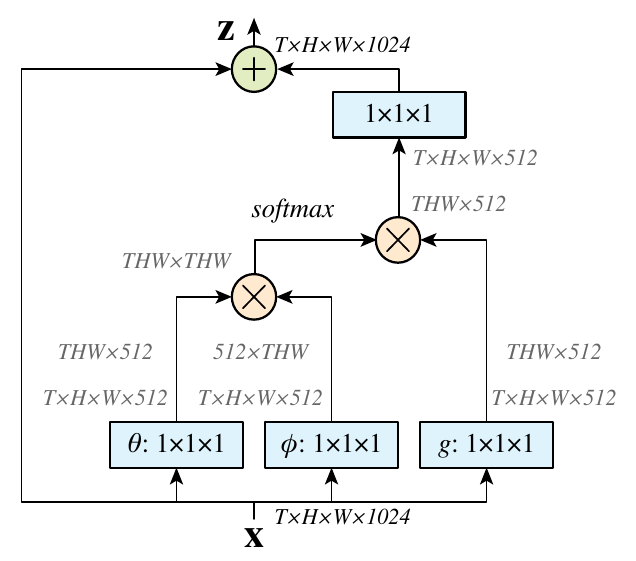
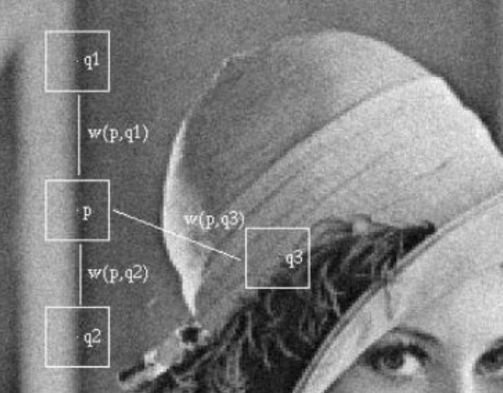
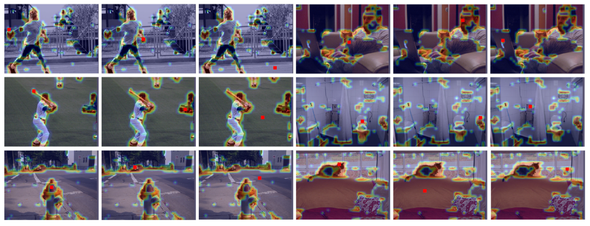

# Non-local Neural Networks

### 这篇笔记的写作者是[VisualDust](https://github.com/visualDust)。

> The non-local block is a popular module for strengthening the context modeling ability of a regular convolutional neural network.

Non-local旨在使用单个Layer实现长距离的像素关系构建，属于自注意力（self-attention）的一种。常见的CNN或是RNN结构基于局部区域进行操作。例如，卷积神经网络中，每次卷积试图建立一定区域内像素的关系。但这种关系的范围往往较小（由于卷积核不大）。

为了建立像素之间的长距离依赖关系，也就是图像中非相邻像素点之间的关系，本文另辟蹊径，提出利用non-local operations构建non-local神经网络。这篇论文通过非局部操作解决深度神经网络核心问题：捕捉长距离依赖关系。

> Both convolutional and recurrent operations are building blocks that process one local neighborhood at a time. In this paper, we present non-local operations as a generic family of building blocks for capturing long-range dependencies. Inspired by the classical non-local means method in computer vision, our non-local operation computes the response at a position as a weighted sum of the features at all positions. This building block can be plugged into many computer vision architectures. On the task of video classification, even without any bells and whistles, our non-local models can compete or outperform current competition winners on both Kinetics and Charades datasets. In static image recognition, our non-local models improve object detection/segmentation and pose estimation on the COCO suite of tasks. Code is available at [this https URL](https://github.com/facebookresearch/video-nonlocal-net) .

本文另辟蹊径，提出利用non-local operations构建non-local神经网络，解决了长距离像素依赖关系的问题。很值得阅读[论文原文](https://arxiv.org/abs/1711.07971)。受计算机视觉中经典的非局部均值方法启发，作者的非局部操作是将所有位置对一个位置的特征加权和作为该位置的响应值。这种非局部操作可以应用于多种计算机视觉框架中，在视频分类、目标分类、识别、分割等等任务上，都有很好的表现。

---

## Non-local means（非局部均值）

非局部均值（Non-local means）起初是一种是一种[影像降噪](https://zh.wikipedia.org/wiki/影像降噪)的算法，**基本思想是：当前像素的估计值由图像中与它具有相似邻域结构的像素加权平均得到**。

由于**一张图片中最相似的点不一定是距离近的点**，反之亦然，故搜寻整张图片上相似的点，利用周期性重复出现的部分如材质纹理或是伸长的边缘等进行降噪可以得到更好的结果。相较于局部（local）的算法（如[高斯模糊](https://zh.wikipedia.org/wiki/高斯模糊)、[非等向性扩散](https://zh.wikipedia.org/wiki/非等向性擴散)）只考虑了每个点附近的点，非局部平均考虑了图上所有的点，故称为非局部的算法。非局部平均算法则对各个目标像素周围定义一个区块，并且**对整个影像的所有像素依照该像素周围区块的区块与目标像素区块的相似度赋予权重、进行平均**。

理论上，该算法需要在整个图像范围内判断像素间的相似度，也就是说，每处理一个像素点时，都要计算它与图像中所有像素点间的相似度。

### 连续的非局部均值

非局部平均的定义为：
$$
NL_{u}(x) = \frac{1}{C(x)}\int_{\Omega}f[d(B_x,B_y)]u(y)dy
$$
其中$u$为要处理的图片，$\Omega$为整张图片的区域，$B_x$为以$x$为中心的一块区域，$d(x,y)$为$x$与$y$的欧几里得距离（$d(x,y)= {|x-y|}_2^2$），$f$是一个递减函数，$C(x)$为标准化因子（$C(x) = \int_{\Omega}{f[d(B_x,B_y)]}dy$）

此式可以解释为图上一点$x$经过降噪后的值为整张图片上所有点的加权平均，其中每个点的权重为该点的附近区块与$x$附近区块的相似度（将两个区块各自的点以相同的排列视为一向量，计算欧几里得距离），再经过一指数衰减的的函数（权重将落在(0,1]区间）。

### 离散的非局部均值

上述的式子所定义的算法为连续的，无法在实际的数位影像中使用，在实际应用中离散化版本的non-localoperations通用表示为：
$$
NL_u[i] = \frac{1}{C(i)}\sum_{j\in\Omega}{w(i,j)g(j)}
$$
其中$u$代表要处理的图片，$g(x)$表示$x$的某种线性变换，$w(i,j)$用于衡量为以$i,j$为中心的点的区块相似度（或者衡量i和j之间的关系），作为计算点$i$将早厚的值时点$j$对应的权重（常见的方法为计算欧几里得距离），$C(i)$为标准化因子（$C(i) = \sum_{i\in\Omega}{w(i,j)}$）。

在这里为了方便理解我写下一个字面意思的公式：s
$$
NonLocal_{u}(i,j) = 标准化(\sum_{所有j\in原图} 点j\times 点i和点j的相似度)
$$
但由于对每个点都要搜寻整张图片上其他的点来比较相似度，故运算复杂度往往会比局部的算法高，很明显这会导致很大的计算开销，所以实现的时候，会设定两个固定大小的窗口：搜索窗口（$D\times D, D=2*Ds+1$）以及邻域窗口（$d\times d, d=2*ds+1$），邻域窗口在搜索窗口中滑动，根据邻域间的相似性确定像素的权值。

如此可以使经过处理的影像更为清晰，并且损失较少的细节。也就是说，相较于local的算法，non-local的方法注重个体和全局的关系。

## 为什么要使用Non-Local

Non-Local operations、卷积以及全连接的目的都是建立某种关系（学术地讲可以叫做“学习一种分布”）。接下来我们说明它们的相似性和区别，以此说明为什么使用Non-Local。

### 卷积和Non-Local

以图像数据为例，要想捕捉长距离依赖，通常的做法是堆积卷积层，随着层数的加深，感受野越来越大，就能把原先非相邻的像素点纳入到一个整体考虑，获取的信息分布广度也越来越高。这种靠堆叠卷积层得到的感受野提升，需要不断重复卷积过程，而这种重复会带来几个弊端：

1. 计算效率很低，层的加深意味着更多的参数，更复杂的关系。
2. 优化困难，需要谨慎设计优化过程。
3. 建模困难，尤其是对于那些多级依赖项，需要在不同距离位置传递信息。
4. 不够通用，卷积操作只能捕获单张图像上的关系，而对视频等序列上的关系无计可施。

有一句话非常好地总结了卷积层如何建立像素间关系：

> convolution layer builds pixel relationship in a local neighborhood

所以建立长距离依赖关系需要更好的、只需要一层的方法，也就是Non-Local：
$$
NL_u[i] = \frac{1}{C(i)}\sum_{j\in\Omega}{w(i,j)g(j)}
$$
在上式中，图像中的每一个位置 j 都被考虑到。与之相对应的，我们可以考虑一下卷积的过程，一个3x3的卷积核，能覆盖到的位置只是位置 j 的相邻点，只能在相邻局部进行操作。所以使用Non-Local更合适。

### 全连接和Non-Local

对比Non-Local和全连接，在non-local operation的公式中：
$$
NL_u[i] = \frac{1}{C(i)}\sum_{j\in\Omega}{w(i,j)g(j)}
$$
$NL_u$中的值是通过计算不同区域之间的关系得到的，而在全连接层中，是通过赋给每个神经元一个学到的权重。换而言之，在全连接层中，两个点或两个区域之间的关系被一个线性的常数确定而在non-local中，这种关系被一个可以自定义行为的函数$w$确定。

再者，non-local公式支持可变大小的输入，并在输出中保持相应的大小，在全连接层中，要求固定大小的输入和输出，并且由于被拉伸成一列，丢失了原有的位置信息。这也是为什么在传统的CNN结构中，卷积处于网络的前半部分用于提取特征，而全连接层通常被用在最后用于分类。当然，non-local operation可以被灵活地添加到深度神经网络中卷积层中的位置，这给了我们一个启发：能够构建一个更丰富的层次结构，将非本地信息和本地信息结合起来。

## Non-Local operations（非局部操作）

在这篇论文中，作者将**非局部操作**（non-local operations）作为一种简洁高效且通用的组件，用于捕获深度神经网络的中的长距离依赖关系。

>  For each query position, the non-local network first computes the pairwise relations between the query position and all positions to form an attention map, and then aggregates the features of all positions by weighted sum with the weights defined by the attention map.

上文直接引用自GCNet的论文。这段话很好地总结了Non-Local Neural Network进行“非局部操作”的流程：对于每个位置，（在一张注意力图中）计算该位置和其他任何位置的相关性，形成一个权值，并用加权的方法计算当前区域的预测值。也就是，non-local operations在计算某个位置$i$处的相关性时，有：
$$
NL_u[i] = \frac{1}{C(i)}\sum_{j\in\Omega}{w(i,j)g(j)}
$$

考虑所有位置features的加权——所有位置可以是空间的，时间的，时空的，这意味着non-localoperations适用于图像、序列和视频问题。

Non-Local operations的优点是：

1. 与递归操作和卷积操作的渐进行为不同，non-localoperations通过计算任意两个位置之间的交互直接捕捉远程依赖，而不用局限于相邻点，摒弃了距离的概念。
2. 作者通过实验表明，在层数很少的情况下，non-localoperations都能取得非常好的性能表现。
3. non-local可以作为一个组件，和其它网络结构结合。

我们在上面“为什么要使用Non-Local”一节中说明了卷积在处理长距离关系上的弊端，并说明了Non-Local为何有效。接下来给出该论文中Non-Local operation的具体实现形式。

### 衡量关系的方法

接下来对论文中的$w(i,j)$和$g(j)$的具体实现方法进行描述（原论文中的实验证明了选择何种$w(i,j)$和$g(j)$对于网络本身的表现来说不很敏感）。
$$
NL_u[i] = \frac{1}{C(i)}\sum_{j\in\Omega}{w(i,j)g(j)}
$$

为了简洁描述，可以将$g(j)$视为一个线性转化$g(j) = W_g \cdot u(j)$，其中$W_g$是要学习的权重矩阵（例如，在图像空间可以采用$1\times 1$卷积实现，在视频空间可以采用$1\times 1\times 1$卷积实现等等）。

#### 使用Gaussian衡量相似度

对于$w(i,j)$，其主要功能是计算衡量两个图像区域的相似度。人们很自然会想到使用高斯函数。在这篇论文中有：
$$
w(x_i,x_j) = e^{x_i^Tx_j}
$$

#### 使用Embedded Gaussian衡量相似度

为了获得一种更加普适的衡量方法，对上述高斯函数进行修改：
$$
w(x_i,x_j) = e^{\theta(x_i)^T\phi(x_j)}
$$
其中$\theta(x_i) = W_{\theta}x_i$和$\phi(x_i) = W_{\phi}x_i$是线性变换，可以将$x_i$映射到其他计算空间，从而更加具有普适性。

#### 使用点积（dot product）衡量相似度

将$w(x_i,x_j)$简单地表示为点积：
$$
w(x_i,x_j) = {\theta(x_i)^T\phi(x_j)}
$$
在这里还是使用了"Embedded sversion"，也就是在$x$的外面套了一个线性变换。在这种情况下归一化因子$C(i)$被简单地描述为$N$（$N$是参与计算的点的个数），这样有助于简化梯度的计算。

如上图，在这篇论文的实验中，点积在top-1准确率中取得了相当不错的成绩。

#### 归一化

观察原公式：
$$
NL_u[i] = \frac{1}{C(i)}\sum_{j\in\Omega}{w(i,j)g(j)}
$$
其中的$C(x)=\sum_{\forall{j}}{w(x_i,x_j)}$是归一化因子。将其带入后，会发现：$\frac{1}{C(i)}w(x_i,x_j)$实际上就是$softmax$的基本形式。所以上述公式可以写作：
$$
NL_u[i] = softmax(\sum_{j\in\Omega}w(i,j))g(j)
$$
如果我们选用点积作为$w(i,j)$进行相似度的衡量，再令$Y = NL_u[i]$，带入后会得到：
$$
Y = softmax(x^TW_{\theta}^TW_{\phi}x)g(x)
$$
**这个就是目前常用的位置注意力机制的表达式。以上关于Non-Local的描述，在深度学习技术中可以归为自注意力机制自注意力机制（self-attention）**，即通过关注特征图中所有位置并在嵌入空间中取其加权平均值来表示图片中某位置处的响应。嵌入空间可以认为是一个更抽象的图片空间表达，目的是汇聚更多的信息，提高计算效率。

`使用点积方法和使用Embedded Gaussian方法区别在于是否使用softmax函数进行激活。`

### Non-Local Block

论文中实现Non-Local的方式是通过一个称为Non-Local block的结构实现的。

上图中$\theta(x_i) = W_{\theta}x_i$和$\phi(x_i) = W_{\phi}x_i$，$w(x_i,x_j) = {\theta(x_i)^T\phi(x_j)}$。将上方提到的归一化处理之后的公式抄下来就有：
$$
Z = softmax(x^TW_{\theta}^TW_{\phi}x)g(x)
$$
和上方计算图中表示的过程完全一样。

上图是一种区域相关性$w(i,j)$的直观表示。可以看出，待计算的像素位置是$p$，故先构造一个以$p$为中心的block，然后计算其他位置block和当前block的相关性，可以看出$q1$和$q2$区域和$q$非常相似，故计算时候给予一个大权重，而$q3$给予一个小的权重。这样的做法可以突出共性（关心的区域），消除差异（通常是噪声）。

当然，你也可以用欧几里得距离进行衡量（小声BB）。

## Summary

这篇论文的主要思想其实是（空间位置）自注意力机制的泛化表达。不过这篇论文只强调了空间注意力，并没有明显使用像[SENet](./[23]Squeeze-and-Excitation-Networks)那样的通道注意力。

原论文中也没有进行对Non-Local生成的attention map进行可视化的实验。不过另一篇论文（GCNet）中进行了这样的实验：s

GCNet的作者从COCO数据集中随机选择6幅图，分别可视化3个不同位置和它们的attention maps。作者发现对于不同位置来说，它们的attention maps几乎是相同的。这说明，**虽然non-local block想要计算出每一个位置特定的全局上下文，但是经过训练之后，实际上形成的attention map受位置的影响非常低。**这也是这篇论文的一个缺陷。

