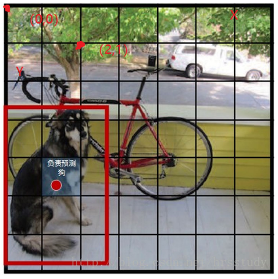
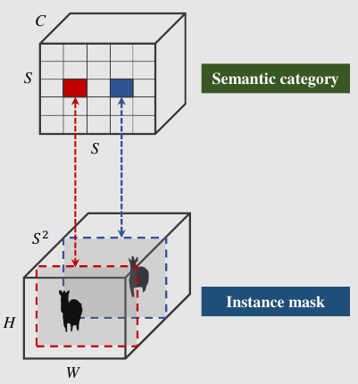
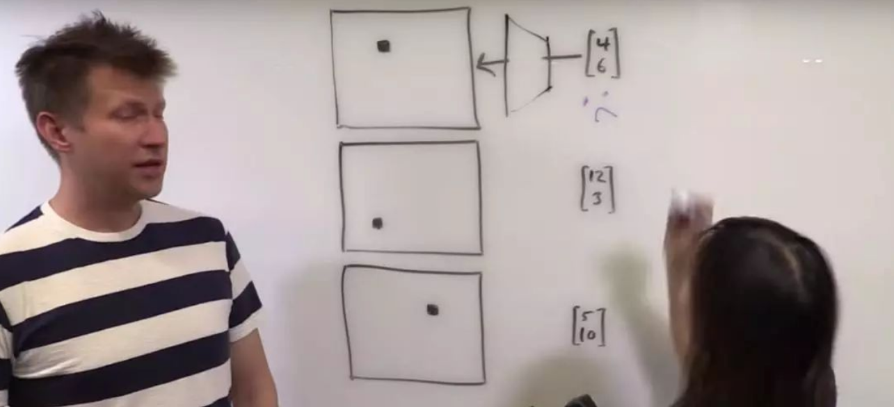
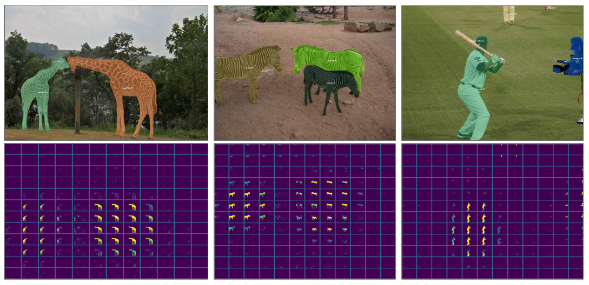

# SOLO: Segmenting Objects by Locations

[Xinlong Wang](https://arxiv.org/search/cs?searchtype=author&query=Wang%2C+X), [Tao Kong](https://arxiv.org/search/cs?searchtype=author&query=Kong%2C+T), [Chunhua Shen](https://arxiv.org/search/cs?searchtype=author&query=Shen%2C+C), [Yuning Jiang](https://arxiv.org/search/cs?searchtype=author&query=Jiang%2C+Y), [Lei Li](https://arxiv.org/search/cs?searchtype=author&query=Li%2C+L)

> We present a new, embarrassingly simple approach to instance segmentation in images. Compared to many other dense prediction tasks, e.g., semantic segmentation, it is the arbitrary number of instances that have made instance segmentation much more challenging. In order to predict a mask for each instance, mainstream approaches either follow the 'detect-thensegment' strategy as used by Mask R-CNN, or predict category masks first then use clustering techniques to group pixels into individual instances. We view the task of instance segmentation from a completely new perspective by introducing the notion of "instance categories", which assigns categories to each pixel within an instance according to the instance's location and size, thus nicely converting instance mask segmentation into a classification-solvable problem. Now instance segmentation is decomposed into two classification tasks. We demonstrate a much simpler and flexible instance segmentation framework with strong performance, achieving on par accuracy with Mask R-CNN and outperforming recent singleshot instance segmenters in accuracy. We hope that this very simple and strong framework can serve as a baseline for many instance-level recognition tasks besides instance segmentation.

实力分割相比于语义分割，不仅需要预测出每一个像素点的语义类别，还要判断出该像素点属于哪一个实例。以往**二阶段**的方法主要是：

1. 先检测后分割：例如Mask R-CNN ，先用检测的方法到得每一个实例，然后对该实例进行语义分割，分割得到的像素都属于此实例。
2. 先分割后分类：先采用语义分割的方法对整个图的所有像素点做语义类别的预测，然后学习一个嵌入向量，使用聚类方法拉近属于同一实例的像素点，使它们属于同一类（同个实体）。

单阶段方法（Single Stage Instance Segmentation）方面的工作受到单阶段目标检测的影响大体上也分为两类：一种是受one-stage, anchot-based 检测模型如YOLO，RetinaNet启发，代表作有YOLACT和SOLO；一种是受anchor-free检测模型如 FCOS 启发，代表作有PolarMask和AdaptIS。上述这些实例分割的方法都不那么直接，也不那么简单。SOLO的出发点就是做更简单、更直接的实例分割。

基于对MSCOCO数据集的统计，作者提出，验证子集中总共有36780个对象，其中98.3％的对象对的中心距离大于30个像素。至于其余的1.7％的对象对，其中40.5％的大小比率大于1.5倍。在这里，我们不考虑像X形两个物体这样的少数情况。总之，**在大多数情况下，图像中的两个实例要么具有不同的中心位置，要么具有不同的对象大小**。

于是作者提出通过物体在图片中的**位置**和**形状**来进行实例的区分。同一张图片中，位置和形状完全相同，就是同一个实例，由于形状有很多方面，文章中朴素地使用尺寸描述形状。

该方法与 Mask R-CNN 实现了同等准确度，并且在准确度上优于最近的单次实例分割器。

---

## YOLO如何描述目标

YOLO的设计思路是的CNN网络将输入的图片分割成$S\times S$​个网格，然后每个单元格负责去检测那些中心点落在该格子内的目标：



可以看到上图中目标“狗”的中心落在左下角一个单元格内，那么该单元格负责预测该目标。每个单元格具有一定信息量（这些信息量堆叠在channel上)：

- 每个单元格会预测$B$​​（bounding box）个边界框，每个边界框包含位置$x,y$​和大小$w,h$​，以及这个bounding box的置信度$c$​（confidence）；

- 每个单元格还要给出对$C$​（num of classes）个类别的概率值。其表征的是由该单元格负责预测的边界框其目标属于各个类别的概率（实际上是在各个边界框置信度下的条件概率）。值得注意的是，不管一个单元格预测多少个边界框，其只预测一组类别概率值，这是Yolo算法的一个缺点。所以从YOLO9000开始，类别概率和置信度一样绑定在每个框上。

在YOLO V3中，每个单元格后面的channel堆叠的共有$[B\times (4+1+C)]$个值。对于$N\times N$个单元格，输出的信息总量为：
$$
N\times N\times [B\times(4+1+C)]
$$
其中$+4$​表示框的位置和大小，$+1$​表示框的置信度，$+C$​​​​表示类别的置信度。如果认为每个单元格仅出现一个物体，则一个单元格中出现多个物体时，势必会造成忽略。调节$B$的值可以解决这个问题。但是过大的$B$会导致运算量的增大。

## SOLO如何描述实例

本文提出一种新的、非常简单的并且思路像极了YOLO的单阶段实例分割方法，首先对一幅图进行$S\times S$​​​个网格的划分，如果某个实例的中心点落入这个网格中，那么这个网格就需要负责这个实例的语义类别和实例类别。其主体思想在于利用图像中不同实例的位置和尺度信息的不同，来区分出不同的实例。

**SOLO框架的中心思想是将实例分割重新表述为两个同时的、类别感知预测和实例感知掩码生成问题**：


作者将实例分割任务分为两个子任务：类别预测和掩码生成。如上图所示，网络分为Category Branch和Mask Branch作为一个SOLO Head，分别完成类别预测和掩码生成。

要理解本文的思想，重点就是要理解SOLO提出的**实例类别（Instance Category）**的概念。作者指出，实例类别就是量化后的**物体中心位置（location）**和物体的**尺寸（size)**。

SOLO的这两个分支前面连接的是FPN骨干网络，它生成不同大小的金字塔特征图，每个级别具有固定数量的通道（通常为 256）。这些feature map用作每个预测头的输入：语义类别和实例掩码。每个Head的权重在不同级别之间共享。

### Semantic Category: Category Branch

SOLO在预测的输出中用C维表示语义类别概率，其中C（num of classes）是类别的数量。我们将输入图像划分为$S\times S$​​​​个网格，故输出空间的维度为$S\times S\times C$​​​。 这种设计基于这样的假设：$S\times S$​​网格的每个单元格必属于一个单独的实例，即只属于一个语义类别。 在推理过程中，C个通道分别表示每个对象实例的类概率。

### Instance Mask: Mask Branch

Mask Branch和Category Branch并行，每个网格单元除了对应一组类别概率也会生成相应的实例掩码。对于输入图像$I$，如果将其划分为$S\times S$个网格，则总共最多有$S^2$个预测掩码。SOLO在输出张量的通道维度上显式地编码掩码信息。

具体来说，对于输入$I\in R^{H,W}$​​实例掩码输出的维度为$H\times W\times S^2$​​。第$k$​​个通道将负责在网格$(i,j)$​​处分割实例，其中$k = i·S + j$​​（$i$和 $j$​从零开始）。为此，在语义类别和类别不可知掩码之间建立了一对一的对应关系：



SOLO中获得实例掩码的直接方法是采用全卷积网络。然而，传统的卷积操作在某种程度上是空间不变的。空间不变性对于某些任务（例如图像分类）是可取的，因为它引入了足够的鲁棒性。然而，对于实例分割任务，我们需要一个空间变化的模型，或者更准确地说，位置敏感的模型。

解决方案非常简单：在网络开始时，受Coord-Conv算子的启发，直接将归一化像素坐标提供给网络。具体来说，SOLO使用一个与输入相同大小的张量，其每一位对应一个所在位置像素的座标，这些坐标被归一化为$[−1, 1]$​​。然后将该张量连接到输入特征并传递到以下层。通过简单地让卷积访问它自己的输入坐标，我们将空间功能添加到传统的 FCN 模型中。`请注意，为了实现上述目标Coord-Conv 并不是唯一的选择。例如，semi-convolutional也是可以的。不过论文中由于是因为简单且易于实现而使用了Coord-Conv。`

如果原始特征张量的大小为$H\times W\times D$，则新张量的大小变为$H\times W\times (D +2)$，其中最后两个通道用于表示$x,y$像素坐标。

### 关于CoordConv

在这里对刚才说道的CoordConv作出补充说明。CoordConv是Uber AI Lab：



这份工作的提出原因是卷积神经网络 (CNN) 在一些很简单很直接的任务里面会失守。例如上图中，监督渲染、监督坐标分类，以及监督回归等任务中，卷积导致座标信息丢失对CNN来说都是大难题。


而CoordConv要做的，就在给神经网络的输入里，加入**两个坐标通道**，每一位分别表示对应像素的$x,y$​座标。

在SOLO中，向前传播部分的代码如下：

```python
def forward_single(self, x, idx, eval=False, upsampled_size=None):
        '''
        :param x: fpn每个level的feature map [N,C,H,W]
        :param idx:  [0,1,2,3,4]中的一个,用来指示当前的level级别
        :param upsampled_size: 最大feature map/C1 的h,w
        '''
        # 因为这里有两个branch，要把输入复制为两份
        ins_feat = x
        cate_feat = x

        # 这里先处理mask分支
        x_range = torch.linspace(-1, 1, ins_feat.shape[-1], device=ins_feat.device) # w --> x
        y_range = torch.linspace(-1, 1, ins_feat.shape[-2], device=ins_feat.device) # h --> y
        # 对x_range, y_range 进行扩充
        # torch.meshgrid（）的功能是生成网格，可以用于生成坐标。函数输入两个数据类型相同的一维张量，两个输出张量的行数为第一个输入张量的元素个数，列数为第二个输入张量的元素个数
        # 其中第一个输出张量填充第一个输入张量中的元素，各行元素相同；第二个输出张量填充第二个输入张量中的元素各列元素相同。
        y, x = torch.meshgrid(y_range, x_range)
        # 将两个坐标扩成4维
        y = y.expand([ins_feat.shape[0], 1, -1, -1])
        x = x.expand([ins_feat.shape[0], 1, -1, -1])
        # 将坐标cancat到feature map的通道上
        coord_feat = torch.cat([x, y], 1)
        ins_feat = torch.cat([ins_feat, coord_feat], 1)
        # 将处理好的新的fearure map送进ins_convs
        for i, ins_layer in enumerate(self.ins_convs):
            ins_feat = ins_layer(ins_feat)
        # 这里将feature map上采样到2H*2W,应该是为了提高mask分割的精度
        ins_feat = F.interpolate(ins_feat, scale_factor=2, mode='bilinear')
        # 这里获得了mask分支的结果
        ins_pred = self.solo_ins_list[idx](ins_feat)

        # 这里开始处理category分支
        for i, cate_layer in enumerate(self.cate_convs):
            # 如果是第一个conv，则需要进行采样，因为category分支的尺寸是h=w=S
            if i == self.cate_down_pos:
                seg_num_grid = self.seg_num_grids[idx]
                cate_feat = F.interpolate(cate_feat, size=seg_num_grid, mode='bilinear')
            cate_feat = cate_layer(cate_feat)
        # 这里获得了category分支的结果
        cate_pred = self.solo_cate(cate_feat)

        # 如果使测试模式,
        # 将mask分支的结果取sigmoid,并且上采样到原始C1的尺寸
        # category分支的结果进行points_nms,这个待会再看
        if eval:
            ins_pred = F.interpolate(ins_pred.sigmoid(), size=upsampled_size, mode='bilinear')
            cate_pred = points_nms(cate_pred.sigmoid(), kernel=2).permute(0, 2, 3, 1)
        return ins_pred, cate_pred
```

### 合并

在SOLO中，类别预测和相应的mask自然由它们的参考网格单元关联，即$k = i\cdot S + j$​​。 基于此，SOLO直接为每个网格形成最终实例分割结果。原始实例分割结果是通过收集所有网格结果生成的。最后，使用非极大抑制（NMS）获得最终实例分割结果，不需要其他后处理操作。

## SOLO如何学习

### Label Assignment

对于类别预测分支，网络需要给出每个$S\times S$​网格的对象类别概率。具体来说，如果网格$(i，j)$​落入任何真实注释蒙版的中心区域，则将其视为正样本；否则，它为负样本。在最近的FCOS等目标检测相关的工作中已经证明了中心采样是有效的，这里SOLO也使用类似的技术进行掩码类别分类。给定ground truth 掩码的质心$(c_x, c_y )$​、宽度$w$​和高度$h$​，中心区域由一个常量$\epsilon$​控制：$(c_x , c_y , \epsilon w,\epsilon h)$​。SOLO的代码中设置$\epsilon = 0.2$​，平均每个ground truth掩码有 3 个正样本。
除了实例类别的标签，我们还为每个正样本提供了一个二进制分割mask。由于存在$S^2$​个网格，因此每个图像都有$S^2$​个输出mask。对于每个正样本，对应的目标二值mask将被注释。可能有人担心mask的顺序会影响mask预测分支，论文中证明了最简单的按行列顺序的排序方法是有效的。

### Loss Functions（损失函数设计）

训练损失函数设计为：
$$
L = L_{cate} + λL_{mask}
$$
其中$L_{cate}$为对语义分割分类的Focal loss，$L_{mask}$是对mask预测的loss：
$$
L_{mask} = \frac{1}{N_{pos}}\sum_{k}1_{P^*_{i,j>0}d_{mask}(m_k,m_k^*)}
$$
其中，$i = int(k/s)$ ，$j = k \mod s$，位置索引是从上到下，从左往右产生的。$N_{pos}$是正样本的数量。$p*$、$m*$分别代表了分类和mask。

$d_{maxk}(\cdot)$​可以采用不同的实现，例如Binary Cross Entropy (BCE)、Focal Loss和Dice Loss。最终出于效率和稳定性，选用了Dice Loss：
$$
L_{Dice} = 1-D(p,q)\\
D(p,q) = \frac{2\sum_{x,y}(p_{x,y}\cdot q_{x,y})}{\sum_{x,y}p^2_{x,y} + \sum_{x,y}q^2_{x,y}}
$$
其中$p,q$​​分别为预测的mask和ground truth mask，$p_{x,y},q_{x,y}$​为对应$x,y$​​位置的值。

## SOLO的有效性



论文中可视化了$S=12$时网格生成的网络输出。子图$i,j$表示由相应的mask通道（在Sigmoid之后）生成的soft mask预测结果。在这里我们可以看到不同的实例在不同的模板预测通道上激活。通过在不同位置显式地分割实例，SOLO将实例分割问题转换为位置感知的分类任务。

在每个网格处将仅代表一个实例，并且可以由多个相邻的mask通道来预测一个实例。在推断过程中，使用NMS抑制冗余掩码。
